# Opco Client Architecture

This is the canonical architecture map for the real Opco Client codebase. It documents the current implementation, not the intended future product. If a behavior is unclear or only partially implemented, it is marked `UNKNOWN`, `PARTIAL`, or `GAP`.

Read this together with:

- `AGENTS.md`
- `README.md`
- `docs/STATE_UPDATE.md`
- Operational Core `docs/ARCHITECTURE.md`
- Operational Core `docs/STATE_UPDATE.md`
- Operational Core `docs/EXTERNAL_API.md`

## Purpose

Opco Client is one generic Expo SDK 57 / React Native / Expo Web application for multiple organizations, contracts, and AppViews. It renders assigned AppViews, stores local cache and unresolved local intent in SQLite, synchronizes with Operational Core, and supports a PWA shell for web cold start.

Operational Core is the source of truth while online. SQLite is not a second authoritative database; it is a cache plus durable storage for unresolved local intent.

## System Boundaries

| Boundary | Responsibility | Not responsible for |
| --- | --- | --- |
| Opco Client | UI, navigation, local cache, outbox, sync orchestration, diagnostics, PWA shell. | Server authorization, final validation, audit persistence, canonical record mutation. |
| SQLite / OPFS | Local renderable snapshots, pending operations, metadata, telemetry. | Authoritative business truth or HTTP response cache. |
| Service worker | Offline app shell, static assets, navigation fallback. | API data, SQLite, OPFS writes, sync. |
| Operational Core `/api/v1` | Authenticated source of truth, AppViews, entity definitions/records, workflows, idempotency. | Client local queue, device storage recovery. |

## Web Security Boundary

Web auth currently keeps the short-lived API access token in `localStorage` so the app can restore an offline-capable session after reload. The API refresh token is not readable by JavaScript on Web; Operational Core stores it in an `HttpOnly; Secure` cookie scoped to `/api/v1/auth` and rotates it server-side. Native keeps both access and refresh tokens in `expo-secure-store`.

This is a deliberate stage tradeoff, not equivalent security to native SecureStore. If attacker-controlled JavaScript executes in the page, it can read the Web access token until it expires. The client therefore relies on a restrictive Content Security Policy to reduce XSS/script injection risk, while keeping cookie-only/BFF access as future architecture work.

Current Web header intent:

- `Content-Security-Policy` is emitted by the static Web server.
- `script-src` is same-origin plus `wasm-unsafe-eval` for Expo SQLite/WebAssembly; it does not allow `unsafe-eval`.
- `style-src` still allows `unsafe-inline` because Expo/RN Web emits inline runtime styles and the exported HTML includes an inline reset style.
- `connect-src` is same-origin plus the configured Operational Core API origin, with `https://web.opco.cl` as the production API origin.
- `worker-src` is same-origin plus `blob:` for Web/runtime workers.
- Service worker cache remains shell/assets only and does not cache `/api/*` or `https://web.opco.cl/api/v1/*`.

Security status: CSP hardening is `IMPLEMENTED`; removing browser-readable access tokens is still a `P2` architectural improvement.

## Auth Reconnect Boundary

Readiness and auth are separate boundaries. `GET /api/v1/ready` is a public readiness probe used by reconnect gating; it does not send the bearer token, does not require the refresh cookie, and must not trigger refresh or logout. A successful ready check only means Operational Core is reachable enough to attempt the next authenticated request.

The first authenticated request after reconnect may discover an expired access token. The intended flow is:

```text
authenticated request -> 401 TOKEN_EXPIRED -> AUTH_REFRESH -> new access token -> retry original request
```

For automatic pending-work sync, the lifecycle performs auth readiness after `/ready` and before business POSTs when the local access token is expired or within the five minute refresh margin. `AUTH_REFRESH` uses a separate `30_000 ms` timeout because losing a refresh response after server-side rotation is materially different from a normal idempotent business retry. If refresh times out or fails with a temporary infrastructure error, no STATE_UPDATE/RECORDS POST is sent for that run; pending intent remains durable for a later trigger.

Only a confirmed invalid session can clear local credentials automatically: revoked/expired/reused/missing refresh token, inactive refresh user/app, or a backend-confirmed `TOKEN_INVALID` on an authenticated request. Network failures, client timeouts, `503`, and `DB_UNAVAILABLE` during refresh are recoverable connectivity/server failures; they must preserve the local session and leave pending work durable for a later retry.

STATE_UPDATE diagnostics persist sanitized auth evidence. `requestHistory` can include `AUTH_REFRESH` entries with method, path template, timing, HTTP status, timeout flag, error code, and local request id. `lastSessionTermination` records the last manual or automatic session termination with reason, source, timestamp, error code, and sanitized request id. It does not persist tokens, cookies, payloads, names, raw owner ids, or form values.

## Layers

| Layer | Real modules | Notes |
| --- | --- | --- |
| 1. UI / navigation | `app/**`, `src/state/session.tsx`, renderer screens. | Expo Router routes and visible app state. |
| 2. AppView runtime | `src/renderers/use-app-view.ts`, `src/lib/app-navigation-cache.ts`, `src/lib/app-view-definitions-cache.ts`. | Loads assigned AppViews and prepared definitions. |
| 3. Renderer registry | `src/renderers/registry.ts`. | Maps `AppView.type` and `workflowKey` to renderers. |
| 4. Workflow adapters | `AttendanceWorkflow`, `StateUpdateWorkflow`, `attendance-offline.ts`, workflow logic helpers. | Attendance is an adapter/preset over `STATE_UPDATE`. |
| 5. Domain/offline logic | `offline-records.ts`, `state-update-offline.ts`, `record-form.ts`, `entity-record-display.ts`. | Pure-ish rules for cache, forms, identity, conflicts, exact intent. |
| 6. Persistence/cache | `local-db.ts`, `local-db-recovery.ts`, `token-storage.ts`, `session-persistence.ts`. | SQLite singleton, schema migrations, local storage. |
| 7. Sync/orchestration | `pending-work-sync.ts`, `records-sync.ts`, `state-update-sync.ts`, `reconnect-sync.ts`, `state-update-refresh.ts`, `use-pending-work-lifecycle.ts`, `SessionProvider`. | Pending-work facade owns engine order; lifecycle trigger details live in a small hook; SessionProvider composes it; each engine is single-flight. |
| 8. Connectivity/lifecycle | `connectivity.ts`, `use-pending-work-lifecycle.ts`, `SessionProvider`, `AppState`, service worker helpers. | Connectivity is a signal, not proof of write success. |
| 9. API boundary | `opco-api.ts`, `config.ts`. | Envelope parsing, bearer auth, refresh, timeout, error taxonomy. |
| 10. Operational Core | External repo `/api/v1`. | Online authority, idempotency, audit, validation. |

## Dependency Graph

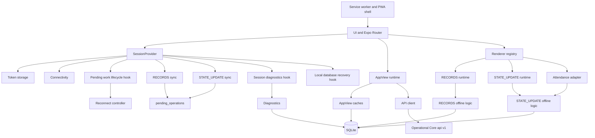

## Core Components

| Subsystem | Responsibility | Main files | Input | Output | Owned state | Dependencies | Source of truth | Errors |
| --- | --- | --- | --- | --- | --- | --- | --- | --- |
| App bootstrap | Mount Expo Router and session context. | `app/_layout.tsx`, `app/index.tsx`, `src/state/session.tsx`. | JS bundle, local token, SQLite state. | Authenticated/offline/anonymous route tree. | Session status. | Token storage, API, SQLite. | API when online, cached snapshot offline. | AUTH, NETWORK, SQLITE, STORAGE. |
| SessionProvider | Central session composition. | `src/state/session.tsx`. | Token, context, connectivity, selected contract, pending state. | Context value, refresh keys, recovery UI, diagnostics panel. | Token state, `me`, `context`, selected contract, sync summaries, refresh keys. | API, local DB, token storage, lifecycle/recovery/diagnostics hooks. | Mixed: API for auth/context, SQLite for cached context. | AUTH, NETWORK, SQLITE, CONNECTIVITY, UNKNOWN. |
| Auth/session | Login, refresh, restore, logout. | `opco-api.ts`, `session-logic.ts`, `token-storage.ts`. | Email/password, stored access token, refresh cookie/token. | Access token, offline session, anonymous state. | Web access token in localStorage; native tokens in SecureStore; ownerKey. | Operational Core auth endpoints. | Operational Core. | INVALID_CREDENTIALS, TOKEN_EXPIRED, refresh errors, NETWORK. |
| Organization/contract selection | Select current contract from `/context` and persist it. | `contract-selection.ts`, `session-persistence.ts`, `SessionProvider`. | Contracts, persisted contract id. | Active contract id. | `selected_contract_id` in `app_metadata`. | SQLite, context. | Operational Core context online. | missing contract, SQLITE. |
| AppView loading | Load assigned AppViews by contract with offline fallback. | `app-navigation-cache.ts`, `use-app-view.ts`, `app/(app)/index.tsx`. | `ownerKey`, `contractId`, token. | Sorted AppView list. | `app_views` snapshot. | API, SQLite. | Operational Core online. | NETWORK fallback, API auth/contract errors. |
| AppView definition cache | Prepare runtime metadata for AppViews. | `app-view-definitions-cache.ts`, `app-view-prewarm.ts`, `local-db.ts`. | Assigned AppViews, entity/workflow API responses. | Prepared definitions and offline availability. | `app_view_definitions`, `entity_definitions`. | API, SQLite. | Operational Core online. | NETWORK, CONTRACT, SQLITE, partial preparation. |
| Renderer registry | Choose renderer for an AppView. | `src/renderers/registry.ts`. | `AppView.type`, `config.workflowKey`. | React renderer component. | None. | Renderer modules, compatibility helper. | Code registry. | Unsupported renderer/workflow. |
| RECORDS runtime | Generic list/detail/new/edit/conflict UI for dynamic records. | `src/renderers/records/**`, `offline-records.ts`. | Entity definition, records query, local pending rows. | Records UI, local writes, conflict UI. | Component state; `entity_records`; `pending_operations`. | API, SQLite, records sync. | Operational Core online; SQLite offline/pending. | NETWORK, API, CONFLICT, SQLITE, validation. |
| STATE_UPDATE runtime | Generic workflow for operational state changes. | `StateUpdateWorkflow.tsx`, `state-update-offline.ts`, `state-update-sync.ts`. | Prepared AppView definition, subject/date/state/extras. | Remote or local state-update intent. | `entity_records`, `pending_operations`, diagnostics telemetry. | API, SQLite, sync. | Operational Core online; local intent until resolved. | CONFLICT, IDEMPOTENCY, NETWORK, TIMEOUT, SQLITE. |
| Attendance adapter | Attendance UX mapped to `STATE_UPDATE`. | `AttendanceWorkflow.tsx`, `attendance-offline.ts`, `attendance-workflow-logic.ts`. | Person, date, status option, observation. | State-update intent and Attendance-shaped UI. | Component state only; shared state-update storage. | State-update runtime, source Personas cache. | Operational Core online. | CONFLICT, NETWORK, SQLITE, missing prewarm. |
| SQLite lifecycle | Open, migrate, recover, reset local DB. | `local-db.ts`, `local-db-recovery.ts`. | Expo SQLite / OPFS availability. | Singleton `LocalDatabase`. | Global singleton state, schema version. | expo-sqlite. | Local device storage. | SQLITE_UNAVAILABLE, OPEN_FAILED, MIGRATION_FAILED, STORAGE_UNAVAILABLE, CORRUPTION_SUSPECTED, ACCESS_HANDLE_BUSY, UNKNOWN. |
| Outbox | Durable queue for unresolved writes. | `pending_operations` via `local-db.ts`, `offline-records.ts`, `state-update-offline.ts`. | Local create/update/state-update saves. | Syncable operation rows. | Payload, attempts, last error, clientRequestId. | SQLite, sync engines. | Local intent until server outcome. | retry/fail/conflict states. |
| RECORDS sync | Push local record CREATE/UPDATE. | `src/sync/records-sync.ts`. | Pending `CREATE`/`UPDATE`. | Synced rows, conflicts, failed/retryable rows. | Single-flight promise; telemetry. | API, SQLite. | Operational Core. | NETWORK, 5xx retry, CONFLICT, 4xx failed, SQLITE. |
| STATE_UPDATE sync | Push `STATE_UPDATE` operations. | `src/sync/state-update-sync.ts`. | Pending state-update operations. | Completed/conflict/failed/retryable rows. | Single-flight promise; telemetry. | API, SQLite, exact reconcile. | Operational Core. | NETWORK, TIMEOUT, IDEMPOTENCY, CONFLICT, SQLITE. |
| Connectivity | Online/offline/unknown signal. | `connectivity.ts`, `reconnect-sync.ts`, `use-pending-work-lifecycle.ts`. | NetInfo fetch/listener. | Connectivity state, reconnect triggers. | Controller previous status, timer, isSyncing. | NetInfo, SessionProvider. | Runtime signal only. | CONNECTIVITY unknown, false online assumptions. |
| Prewarm | Prepare offline AppView metadata and selected source data. | `app-view-prewarm.ts`. | Assigned AppViews. | Prepared definitions; source records cache for workflows. | Active prewarm map. | API, SQLite. | Operational Core online. | NETWORK preserves ready cache; partial/error status. |
| Diagnostics | Passive observation plus explicit operator commands. | `state-update-route-logic.ts`, `records/sync-diagnostics.ts`, `use-session-diagnostics.ts`, diagnostics route, `SessionProvider`. | SQLite rows, request wrapper timings, button presses. | Fingerprinted UI diagnostics and manual recovery/sync actions. | `app_metadata` state-update telemetry; UI state inside diagnostics hook. | API wrappers, SQLite. | Passive derived data unless an operator command is pressed. | diagnostics unavailable. |
| PWA/service worker | Offline shell and static asset cache. | `pwa.ts`, `generate-service-worker.mjs`, `start-web.mjs`, `public/manifest.json`. | Built `dist`, browser service worker APIs. | Precached shell, navigation fallback, readiness status. | Cache Storage shell cache. | Browser SW, Cache Storage. | Build artifacts. | shell-missing, preparing, unsupported. |
| Operational Core boundary | External API and authoritative mutation. | `opco-api.ts`, backend docs. | Bearer token, contract/appView/entity ids, payloads. | Envelope data/errors. | None in client. | Network. | Operational Core DB. | HTTP, CONTRACT, AUTH, DB_UNAVAILABLE, envelope errors. |

## App Bootstrap And Lifecycle

### Online Cold Start

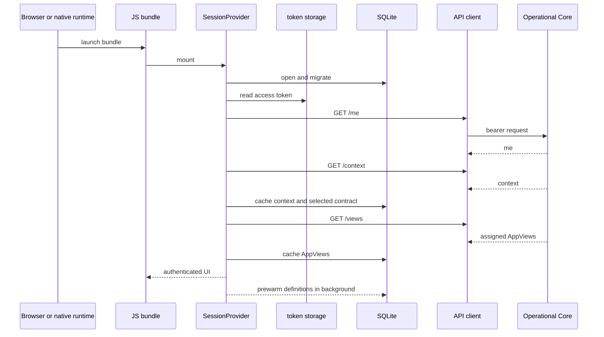

Blocking: JS bundle, SessionProvider mount, token restore, SQLite open enough to recover local state, auth/context decision for protected routes. Background: AppView prewarm and best-effort sync after sign-in.

### Offline Cold Start

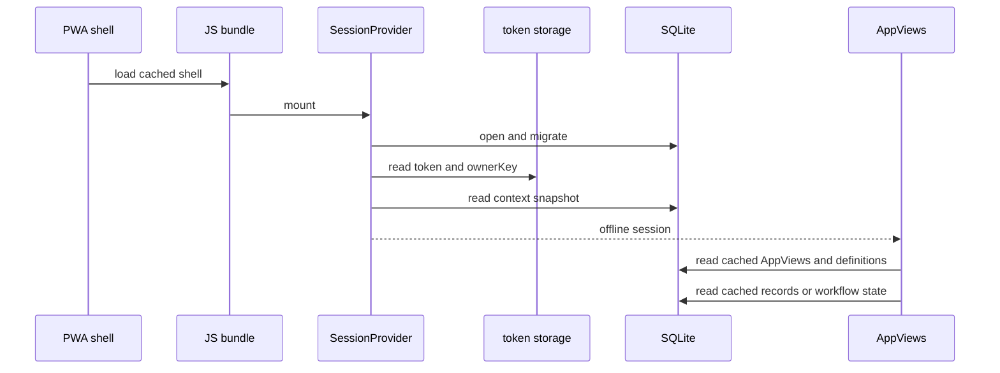

Blocking: service worker shell availability on web, SQLite open, session ownerKey and context snapshot. If SQLite is unavailable, the recovery screen replaces the app UI. If no context snapshot exists, the app cannot present authorized offline data.

### Return From Background

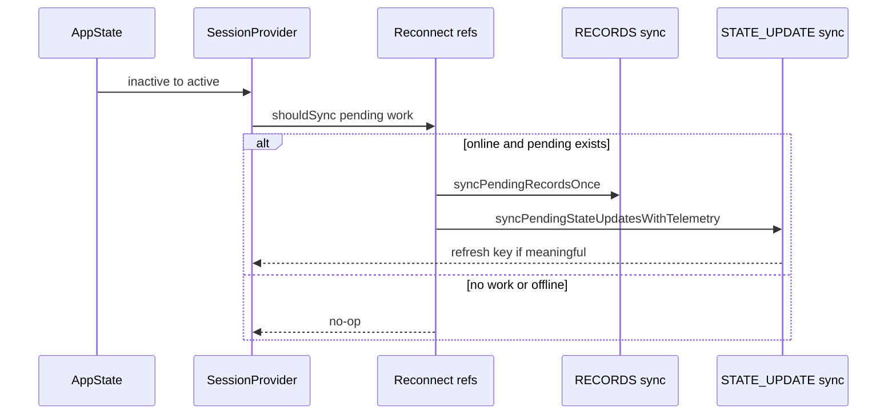

### PWA Reload

The browser serves `index.html` from network when available. If navigation fails, the service worker returns cached `index.html`. API calls are not served from the service worker cache. The app then follows online or offline cold-start rules depending on API/connectivity and SQLite state.

## SessionProvider Responsibility Audit

| Responsibility | Classification | Evidence |
| --- | --- | --- |
| Auth state and token refresh callbacks | CORE_SESSION | Owns `token`, `me`, `status`, `signIn`, `signOut`. |
| Contract context and selected contract | CORE_SESSION | Owns `context`, `selectedContractId`, persisted selection. |
| SQLite recovery controller | EXTRACTED_ORCHESTRATION | `use-local-database-recovery.ts` watches `localDatabaseStorageState`, exposes retry/reset, and keeps reset explicit. |
| SQLite recovery screen | UI_COMPOSITION | `SessionProvider` still renders the recovery UI when local storage is unavailable. |
| AppView prewarm kick-off | ORCHESTRATION | Calls `prewarmAssignedAppViewsOnce` after contract/view load. |
| RECORDS sync trigger | EXTRACTED_ORCHESTRATION | `use-pending-work-lifecycle.ts` calls `syncPendingWork`, which runs RECORDS first. |
| STATE_UPDATE sync trigger and telemetry wrapper | EXTRACTED_DIAGNOSTICS | `use-session-diagnostics.ts` owns `syncPendingStateUpdatesWithTelemetry` and telemetry persistence. |
| Reconnect and foreground/resume orchestration | EXTRACTED_ORCHESTRATION | `use-pending-work-lifecycle.ts` owns reconnect controller refs, AppState effect, pending checks, and stale-run guards. |
| Refresh keys for mounted renderers | ORCHESTRATION | Owns `recordsReconnectRefreshKey` and `stateUpdateReconnectRefreshKey`. |
| State-update diagnostics UI overlay | DIAGNOSTICS | Renders diagnostics panel when query flag is set. |
| Diagnostic API/store wrapping | EXTRACTED_DIAGNOSTICS | `use-session-diagnostics.ts` wires diagnostic store/API and separates observation from commands. |
| Combined responsibilities in one provider | TECHNICAL_DEBT | The file still owns auth/session, context, selected contract, recovery UI, prewarm kick-off, refresh keys, and public context composition. |

Assessment: `SessionProvider` is partially reduced, not fully resolved. The lifecycle sync details, local database recovery controller, and state-update diagnostics wiring are extracted into small hooks with pure guard helpers. `SessionProvider` remains the public composition point and still concentrates auth, context, contract selection, recovery UI, prewarm kick-off, and refresh keys. This no longer carries the same sync/diagnostics/recovery implementation weight, but it remains a P2 concentration point.

## AppViews

Flow:

```text
contract -> GET /views -> app_views cache -> AppView definition prewarm -> registry -> renderer
```

Known `AppView.type` values:

| Type | Client implementation |
| --- | --- |
| `RECORDS` | Implemented by `RecordsRenderer`. |
| `WORKFLOW` | Implemented for `workflowKey = state-update` and `workflowKey = attendance`; unsupported UI for unknown workflows. |
| `BOARD` | Unsupported UI only. |
| `DASHBOARD` | Unsupported UI only. |

`AppView.type` selects the renderer category. `config.workflowKey` selects behavior inside the `WORKFLOW` category. Attendance is not an AppView type; it is a workflow key and adapter.

## Renderer Registry

`src/renderers/registry.ts` is a thin boundary:

- `RECORDS` -> `RecordsRenderer`
- `WORKFLOW + attendance` -> `AttendanceWorkflow`
- `WORKFLOW + state-update` -> `StateUpdateWorkflow`
- unsupported workflows -> `UnsupportedWorkflow`
- `BOARD` / `DASHBOARD` -> `UnsupportedRenderer`

The registry depends on `isStateUpdateCompatibleWorkflow()` but does not own domain rules, sync, persistence, or conflict behavior.

## RECORDS Engine

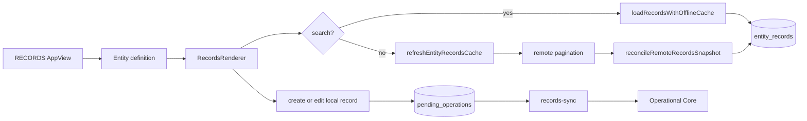

Rules:

- Remote pagination for full refresh uses page size 100 and max 1000 pages.
- Normal list page renders page size 25.
- Search uses `loadRecordsWithOfflineCache()` and is not authoritative.
- Full refresh uses all remote pages, then reconciles stale `synced` rows.
- `partial/search response != authoritative snapshot`; it cannot delete cache by absence.
- Scope is `ownerKey + contractId + entityTypeId`.
- Remote records are upserted under a scoped local identity to prevent cross-owner/contract/entity collisions.
- Local statuses are `synced`, `pending_create`, `pending_update`, `syncing`, `failed`, and `conflict`.
- `pending_create`, `pending_update`, `syncing`, `failed`, and `conflict` are not deleted because a remote partial response does not include them.
- Local RECORDS create/update writes are atomic: the `entity_records` snapshot and matching `pending_operations` row are written in the same SQLite transaction. The UI must not report local save success before that transaction commits.
- Remote RECORDS completion is atomic: `server_id`, backend `remote_updated_at`, `sync_status`, duplicate remote-row cleanup, and pending operation cleanup commit together or roll back together.
- RECORDS conflict and definitive failure markers update the record and outbox coherently in one SQLite transaction.

Conflict model:

- UPDATE sync performs preflight `GET record`.
- If remote `updatedAt` differs from local `remote_updated_at`, it marks conflict before PATCH.
- Old cache without `remote_updated_at` is treated as conflict rather than patching blindly.

Recovery model:

- `syncing` is not irreversible. If a `CREATE` or `UPDATE` outbox row exists, a later sync trigger may select it again according to the normal retry policy.
- Active local intent with no outbox is `ORPHANED_LOCAL_INTENT`. The client must not invent the missing payload or silently mark it synced.
- A `CREATE` or `UPDATE` outbox row with no matching `entity_records` row is `ORPHANED_OUTBOX`. The client must not invent a record snapshot or silently delete the operation.
- A `synced` record with an active `CREATE` or `UPDATE` outbox row is `INCONSISTENT_COMPLETION`. The client must not perform a hidden mutation to reconcile it.
- `getRecordOutboxConsistency()` reports these states with fingerprinted owner/contract/entity/local/operation identifiers for diagnostics and operator support.

## STATE_UPDATE Engine

This document does not repeat the full state-update audit. The canonical details are in `docs/STATE_UPDATE.md`.

Global fit:

```text
Workflow adapter -> intent -> SQLite entity_records + pending_operations -> SessionProvider orchestrator -> state-update-sync -> API -> Operational Core -> exact reconcile -> refresh signal -> mounted UI
```

Attendance is only an adapter/preset over this path. It does not own a separate outbox, sync loop, conflict engine, or storage engine.

## SQLite

Local database: `opco-client.db`. Current schema version in code: `8`.

| Table | Category | Purpose | Ownership | Authority | Scope | Lifecycle |
| --- | --- | --- | --- | --- | --- | --- |
| `app_metadata` | METADATA / TELEMETRY | Schema version, selected contract, state-update diagnostics telemetry. | Local DB. | Local metadata only. | Global or owner-keyed metadata keys. | Created/migrated locally; reset only after explicit local reset. |
| `context_snapshot` | CACHE DATA | Cached `/me` and `/context` for offline startup. | SessionProvider/local DB. | Cache of Operational Core context. | `owner_key`. | Upserted after successful auth/context; read on offline restore. |
| `app_views` | CACHE DATA | Assigned AppViews for a contract. | AppView navigation cache. | Cache of `/views`. | `owner_key + contract_id`. | Upserted online; read offline; cleared on logout navigation cache clear. |
| `app_view_definitions` | CACHE DATA / METADATA | Prepared renderer/workflow metadata and readiness status. | Prewarm and renderers. | Cache of API definitions/workflow metadata. | `owner_key + contract_id + app_view_id`. | Reconciled against assigned AppViews; ready cache preserved on network prewarm failure. |
| `entity_definitions` | METADATA | Contract-wide entity field definitions. | Definition cache/prewarm. | Cache of Operational Core entity definition. | `contract_id + entity_type_id`. | Upserted online; used offline; not owner-keyed while backend definitions are contract-wide metadata. |
| `entity_records` | CACHE DATA / UNSYNCED INTENT | Renderable record snapshots, local workflow snapshots, conflict snapshots, remote version. | RECORDS and STATE_UPDATE runtimes. | Cache plus local intent until resolved. | `owner_key + contract_id + entity_type_id`; state-update values also include appView/date/subject. | Remote upsert, local create/update, sync completion, conflict/failure, scoped reconcile. |
| `pending_operations` | UNSYNCED INTENT | Shared outbox for `CREATE`, `UPDATE`, `STATE_UPDATE`. | Offline record/state-update logic. | Local unresolved command. | `owner_key`, operation row references contract/entity/local record. | Created by local writes, selected by sync, deleted on completion, retained/marked for failure/conflict. |
| `sync_telemetry` | TELEMETRY | Sync phases and timestamps. | Sync engines and renderers. | Passive local telemetry. | `owner_key + contract_id + entity_type_id`; state-update uses `workflow:<appViewId>`. | Updated during sync/refresh/reconcile; failure should not change business behavior. |

Categories:

- CACHE DATA: remote-derived snapshots used for offline rendering.
- UNSYNCED INTENT: user action not yet durably resolved by Operational Core.
- METADATA: local runtime settings and prepared definitions.
- TELEMETRY: passive sync/recovery observations.

## Local Identity

| Identifier | Meaning |
| --- | --- |
| `local_id` | Stable local row identity used by UI and SQLite foreign keys. |
| `server_id` | Operational Core `EntityRecord.id`, nullable until remote confirmation. |
| `ownerKey` | Local user/tenant cache scope: `organization.id:user.id`. |
| `contractId` | Operational context selected from `/context`. |
| `entityTypeId` | Dynamic record entity scope. For state-update telemetry, `workflow:<appViewId>` is used as a telemetry key. |
| `appViewId` | Experience scope and workflow config identity. |

Remote entity record identity is `ownerKey + contractId + entityTypeId + serverId` in the local cache. Operational Core record IDs are stable remote record IDs; the client still scopes them by owner, contract, and entity type so shared devices, contract switching, or future non-global IDs cannot collide locally. `AppViewId` and date are not part of remote record identity: the same remote record may be visible through two AppViews, two dates, or two workflow snapshots without requiring two `entity_records` rows.

Workflow intent identity is separate. State-update `update-current` local rows are scoped by workflow semantics such as `appViewId`, `subjectRecordId`, date, uniqueness, and history mode. Those rows represent unresolved or cached workflow intent, not the generic remote record identity used by `RECORDS`.

Historical incident, architecture-only: earlier local identity assumptions allowed Attendance-derived rows to be interpreted in the wrong local workflow scope. The current invariant is that remote record identity and workflow intent identity are not mixed.

## Entity Definitions Scope

Operational Core exposes entity definitions through `GET /api/v1/contracts/:contractId/entities/:entityTypeId` after contract membership authorization. The response is an active contract entity schema: entity metadata, active fields, active options, relation config, display config, and validation config. It does not include records or related record values.

Current backend semantics make definitions contract-wide metadata:

- ADMIN and MEMBER users in the same contract receive the same definition after contract access is accepted.
- Field definitions, options, relation config, and display config are not user-specific.
- AppView assignment controls which renderer/experience a user sees; it does not change the entity definition payload.
- A user can only reuse a cached definition after the app has an owner-scoped session/context and an assigned AppView or workflow definition that points to that contract/entity.

Therefore `entity_definitions` intentionally uses `contract_id + entity_type_id`, while `app_views`, `app_view_definitions`, `entity_records`, and pending work remain owner-scoped. If Operational Core later adds per-user field visibility or per-AppView definition shaping, this becomes an isolation bug and requires an owner- or AppView-scoped cache migration before enabling that backend behavior.

## Outbox

Real operation types:

- `CREATE`: RECORDS create.
- `UPDATE`: RECORDS update.
- `STATE_UPDATE`: generic workflow state update, including Attendance.

| Step | Owner |
| --- | --- |
| Create operation | `createLocalRecord`, `updateLocalRecord`, `saveStateUpdateLocally`. |
| Select operation | `listPendingOperations` or `listPendingStateUpdateOperations`. |
| Mark syncing | `records-sync` or `state-update-sync`. |
| Complete | `completePendingOperation` or `completeStateUpdateOperation`. |
| Retry | `retryPendingOperation` or `retryStateUpdateOperation`. |
| Conflict | `markPendingOperationConflict` or `markStateUpdateOperationConflict`. |
| Fail | `failPendingOperation` or `failStateUpdateOperation`. |

Automatic retry:

- Network-like errors and 5xx generally remain retryable.
- SQLite unavailable is retryable if storage later recovers.
- `syncing` rows are eligible under current reconnect/retry policy.

Manual intervention:

- RECORDS conflicts.
- STATE_UPDATE conflicts.
- Definitive API/validation failures.
- `IDEMPOTENCY_KEY_REUSED`.
- `IDEMPOTENCY_RESULT_UNAVAILABLE` when exact remote reconcile cannot safely prove success.

RECORDS outbox integrity:

- `CREATE` and `UPDATE` local saves commit their renderable `entity_records` snapshot and durable outbox row in one SQLite transaction.
- Completion commits remote identity/version updates and outbox cleanup in one SQLite transaction.
- Conflict, retryable failure, and definitive failure state transitions commit the outbox error metadata and record status together.
- Crash leftovers are observable through `getRecordOutboxConsistency()` and RECORDS diagnostics. Detection is read-only and sanitized; recovery requires normal sync retry or explicit operator/product handling.

## Global Sync Orchestration

Triggers:

| Trigger | Path | Engines |
| --- | --- | --- |
| Sign-in/startup with token | `SessionProvider.signIn` through `syncPendingWork`. | RECORDS then STATE_UPDATE best effort. |
| Reconnect | `use-pending-work-lifecycle` plus `createReconnectSyncController`. | RECORDS then STATE_UPDATE. |
| Unknown to online | same lifecycle hook and reconnect controller. | RECORDS then STATE_UPDATE. |
| Foreground/resume | `use-pending-work-lifecycle` AppState effect. | RECORDS then STATE_UPDATE if pending work exists. |
| Manual retry/sync | Session context method returned by `use-pending-work-lifecycle`; diagnostics UI uses explicit commands. | RECORDS then STATE_UPDATE. |
| AppView refresh | Renderer-level load/refresh. | RECORDS full refresh or workflow GET/cache hydration; not necessarily outbox push. |

Ordering is centralized by `syncPendingWork()`: RECORDS sync first, then STATE_UPDATE sync. `SessionProvider` still decides whether session/context exists, but `use-pending-work-lifecycle.ts` owns reconnect, unknown-to-online, foreground/resume, pending checks, manual pending-work callback wiring, and stale-run guards. `SessionProvider` still owns auth/session, context refresh, selected contract, recovery UI, prewarm kick-off, pending-count state, and renderer refresh keys.

Reconnect-like automatic triggers do not treat NetInfo `online` as proof that Operational Core is ready. For reconnect, unknown-to-online, startup-with-pending, and foreground/resume, the lifecycle hook first confirms owner/token/contract scope, checks durable pending work, then runs a short `GET /api/v1/ready` gate before POST sync. The ready probe uses its own `2_500 ms` timeout, at most three attempts, bounded backoff, and one shared local `syncRunId` with `attemptNumber` on each request-history entry. If the scope becomes ready after NetInfo already moved to online, the hook performs a one-time catch-up for that scope by re-checking durable pending work; this avoids waiting for a later remount or foreground event. A ready gate run cannot remain semantically active forever: stale persisted `reconnecting` telemetry without a `READY_CHECK` request is marked `interrupted` on hydration, scope changes are marked `cancelled_scope_changed`, and active run guards are cleared in `finally`.

Reconnect diagnostics persist a sanitized preflight timeline for the latest reconnect/recovery run: reconnect detection, debounce completion, `shouldSync` start/end, individual local pending-query durations, `runSync` start, readiness start/end, and readiness attempt count. This timeline is diagnostic only; SQLite/outbox remains the authority for selecting real work. If all readiness attempts fail while the app remains active and online with durable pending work, the lifecycle schedules recovery catch-ups for the same scope with progressive delays capped at `60_000 ms`, and cancels them on offline, background/inactive app state, scope change, or pending=0.

After readiness succeeds and before pending business writes, the hook checks the access-token `exp` claim. Tokens that are expired or within the five minute margin are refreshed once through `AUTH_REFRESH` with the same local `syncRunId`; opaque/unparseable tokens are not proactively refreshed and instead rely on the normal authenticated-request `401 TOKEN_EXPIRED` path. Recoverable refresh failures (`timeout`, network, `503`, `DB_UNAVAILABLE`) block that run without clearing credentials or consuming business retry semantics. Backend-confirmed invalid refresh/session responses still allow automatic logout.

Mounted workflow renderers must use the `SessionProvider` connectivity value, not independent NetInfo listeners. `SessionProvider` is the canonical runtime connectivity source for UI, lifecycle, and diagnostics. Workflow pending indicators come from durable SQLite/outbox state for the same owner/contract/AppView/date/entity scope. `online + pending` is only `PENDING`; `SYNCING` requires the pending-work engine to be actively running, `RECONNECTING` requires the readiness gate to be active in runtime, and `CONFIRMING` means a write or timeout reconciliation is still being confirmed.

Each engine has its own module-level single-flight promise. The reconnect controller also debounces and avoids overlapping reconnect runs. The pending-work facade does not add another queue or retry policy; it preserves the current behavior where a thrown RECORDS engine failure aborts the combined orchestration and a later trigger retries. Per-operation RECORDS failures are normally captured inside the RECORDS engine, so STATE_UPDATE still runs after ordinary retryable/failed/conflict record results. Lifecycle runs compare their starting token/owner/contract scope with the current scope before applying refresh side effects, so logout or contract switch does not apply stale refresh results.

Failure isolation:

- A telemetry write failure should not drop pending work.
- Sync engine failure is persisted on the affected operation when possible.
- A later reconnect/foreground/manual retry can run again.

## Connectivity

Connectivity status:

- `offline`: `isInternetReachable === false` or `isConnected === false`.
- `online`: `isConnected === true`.
- `unknown`: neither value is known.

Connectivity is a runtime signal only. It is not proof that a backend write succeeded or failed. A timeout after a POST may still correspond to a committed Operational Core write; state-update sync attempts exact remote reconciliation where safe.

`Last STATE_UPDATE sync` is written only by a real sync engine run and is presented as the last completed sync. Readiness checks and reconnect detection may update current activity and request history, but they do not fabricate a sync run. A shared local `syncRunId` correlates reconnect/catch-up lifecycle, ready probe diagnostics, pending-work orchestration, STATE_UPDATE sync telemetry, and visible UI diagnostics without being sent to the backend.

## Prewarm

Definition prewarm:

- AppView definitions for assigned AppViews.
- RECORDS entity definitions.
- Workflow metadata for `state-update` and `attendance`.
- Attendance statuses mapped from active backend options.
- Unsupported AppViews get a prepared unsupported definition.

Data cache:

- RECORDS data is demand-cached on AppView load/refresh, not globally prewarmed.
- State-update target data is hydrated from workflow GET responses.
- Attendance prewarm additionally refreshes the source Personas entity because offline search needs local people.
- Generic state-update prewarm refreshes the source entity records for offline subject search.

Definition readiness and data readiness are separate:

- `DEFINITION_READY`: renderer/workflow metadata exists locally and can build the screen.
- `DATA_READY`: the local data required by that renderer has been successfully hydrated at least once.
- `OFFLINE_READY`: both definition and required data are ready.
- `PARTIAL_OFFLINE`: definition exists, but required data has never been authoritatively hydrated.

Home advertises `Disponible sin conexion` only for `OFFLINE_READY`. If only the definition is available, it shows `Configuracion disponible; datos aun no descargados`. If no prepared definition exists, it shows `Requiere conexion para preparar datos`.

Readiness uses existing `sync_telemetry.last_full_refresh_completed_at` as the durable hydration marker. A full successful refresh with zero remote records is data-ready because the empty snapshot is known. Search-only loads, partial pages, and failed/network refreshes do not create readiness. A later network prewarm failure does not clear previous data readiness.

Readiness scope:

- RECORDS: `ownerKey + contractId + entityTypeId` through sync telemetry; Home resolves it per AppView.
- STATE_UPDATE: `ownerKey + contractId + sourceEntityTypeId` for subject selection data.
- Attendance: same STATE_UPDATE source hydration rule; Personas may be loaded empty and still count as known.

An AppView can be available offline as a prepared definition while its data is still missing, but it must not be advertised as fully offline-ready until its renderer data requirement is satisfied.

## Offline Lifecycle

Offline cold start:

```text
PWA/native launch -> app shell -> JS -> SQLite open/migrate -> token/ownerKey read -> context snapshot -> AppViews cache -> prepared definition -> local records/workflow state
```

Potential blockers:

- Service worker unsupported or shell missing on web.
- SQLite/OPFS unavailable.
- ACCESS_HANDLE_BUSY from another tab/runtime.
- No stored token/ownerKey.
- No cached context/AppViews/definition/data for the selected path.

## PWA And Service Worker

`npm run build:web` exports the Expo Web bundle and runs `scripts/generate-service-worker.mjs`.

Service worker responsibilities:

- Precache `index.html`, JS bundles, assets, manifest, icons, fonts/WASM.
- Version shell cache by build hash.
- Delete older shell caches during activate.
- Serve navigation fallback to `index.html` when network navigation fails.
- Respond to `OPCO_SHELL_STATUS` for readiness diagnostics.

Exclusions:

- Non-GET requests.
- `/api/*`.
- `https://web.opco.cl/api/v1/*`.

The service worker does not read or write SQLite. Application offline data lives in SQLite/OPFS and token/storage APIs, not Cache Storage.

## SQLite / OPFS Recovery

Error causes:

| Cause | Meaning | User behavior |
| --- | --- | --- |
| `SQLITE_UNAVAILABLE` | Global visible storage error code. | Recovery screen. |
| `OPEN_FAILED` | SQLite open failed. | Retry or reset if available. |
| `MIGRATION_FAILED` | Local migration failed. | Retry; schema version is not advanced. |
| `STORAGE_UNAVAILABLE` | Browser/device storage, OPFS, quota, SharedArrayBuffer, or isolation issue. | Retry or reset. |
| `CORRUPTION_SUSPECTED` | SQLite reported corruption/malformed DB. | Retry or explicit reset. |
| `ACCESS_HANDLE_BUSY` | Another web runtime owns the OPFS access handle. | Close other tab/window, retry; no reset prompt. |
| `UNKNOWN` | Unclassified storage failure. | Retry or reset if available. |

Reset protections:

- Never automatic.
- Requires explicit confirmation.
- Attempts to count pending/failed/conflict rows first.
- Warns about unsynchronized local changes.
- Clears only local SQLite/cache state, not Operational Core data.

## API Client

`src/lib/opco-api.ts` owns:

- Base URL from `EXPO_PUBLIC_OPCO_API_URL`.
- Public client id from `EXPO_PUBLIC_OPCO_CLIENT_ID`.
- Bearer auth headers.
- Web refresh through HttpOnly cookie.
- Native refresh token transport through SecureStore.
- 12 second `AbortController` timeout.
- 30 second `AUTH_REFRESH` timeout for refresh-token rotation requests.
- JSON envelope parsing.
- Contract shape assertions for records, workflows, updatedAt, and idempotency results.
- Request timing diagnostics for network failures.

Error groups:

| Group | Examples | Retryability | User behavior |
| --- | --- | --- | --- |
| AUTH | `TOKEN_MISSING`, `TOKEN_INVALID`, `TOKEN_EXPIRED`, refresh errors. | Refresh can retry once; invalid refresh logs out. | Login/offline restore/anonymous. |
| NETWORK | fetch failure, no response. | Retryable. | Offline fallback or pending retry. |
| TIMEOUT | aborted request after 12s. | Retryable; state-update may reconcile remotely. | Keep intent until confirmed. |
| API | 4xx/5xx envelope errors. | 5xx retryable, most 4xx failed. | Visible error/failure. |
| CONFLICT | `REMOTE_VERSION_CHANGED`, workflow `CONFLICT`. | Manual. | Conflict UI. |
| IDEMPOTENCY | `IDEMPOTENCY_KEY_REUSED`, `IDEMPOTENCY_RESULT_UNAVAILABLE`. | Manual unless exact update-current reconcile proves success. | Failed/manual recovery. |
| SQLITE | `SQLITE_UNAVAILABLE`. | Retryable after storage recovery. | Recovery screen or retry later. |
| STORAGE | OPFS/quota/corruption/access handle causes. | Depends cause; explicit reset only. | Recovery UI. |
| CONNECTIVITY | `online`, `offline`, `unknown`. | Signal only. | Controls online/offline path and reconnect trigger. |
| CONTRACT | invalid envelope, missing required `updatedAt`, unsupported shape. | Not auto-retry as success. | Controlled error. |
| UNKNOWN | unexpected JS error. | Usually retry unless classified otherwise. | Generic controlled error. |

## Source Of Truth Matrix

| Domain | Online source of truth | Offline source | Pending source | Overwrite/reconcile rule |
| --- | --- | --- | --- | --- |
| Session auth | Operational Core auth endpoints. | Stored access token plus context snapshot if network-like failure. | None. | 401 clears session; network can restore offline. |
| Session context | `/me` and `/context`. | `context_snapshot`. | None. | Online response refreshes snapshot. |
| Contract selection | User selection over `/context` contracts. | `selected_contract_id`. | None. | Persisted selection is advisory; invalid selection falls back by selection logic. |
| AppViews | `/contracts/:contractId/views`. | `app_views`. | None. | Online response replaces cache; network fallback reads cache. |
| AppView definitions | Entity/workflow API responses. | `app_view_definitions` and `entity_definitions`. | None. | Ready definition may be preserved across network prewarm failure. |
| Entity records | Operational Core records API. | `entity_records` with `synced`. | `pending_operations` plus non-synced `entity_records`. | Full refresh may delete stale `synced`; unresolved rows are preserved. |
| RECORDS writes | Operational Core mutation result. | Local optimistic row. | `CREATE`/`UPDATE`. | Completion stores remote id/version; conflict requires user. |
| STATE_UPDATE writes | Operational Core state-update engine. | Local state-update snapshot. | `STATE_UPDATE`. | Exact remote confirmation can complete; conflicts/idempotency errors stay explicit. |
| Attendance | Operational Core Attendance/state-update backend. | Shared state-update cache plus source Personas cache. | `STATE_UPDATE`. | Attendance adapter maps to generic state-update semantics. |
| Sync telemetry | Local observation. | `sync_telemetry`, `app_metadata`. | None. | Passive; must not affect business result. |
| Diagnostics observation | Derived from local rows and request wrappers. | Local telemetry/diagnostic query. | None. | Passive and fingerprinted. |
| Diagnostic operator actions | Existing retry/sync/reset commands after explicit user action. | Local state plus Operational Core for sync. | Existing outbox/recovery command. | May mutate local state or call mutation APIs only after the button/confirmation. |
| PWA assets | Current deployed build. | Service worker shell cache. | None. | New build cache replaces old shell cache; never deletes SQLite. |

## Refresh And Invalidation

| Event | Cache refresh | UI update |
| --- | --- | --- |
| Contract selected | Load `/views`, cache AppViews, start prewarm. | Home/routes receive selected contract state. |
| RECORDS AppView load without search | Full refresh and reconcile. | Local state set from cached rows after reconcile. |
| RECORDS search | Partial load/cache upsert only. | Search result UI; no destructive cleanup. |
| RECORDS sync completion | Pending count and telemetry refresh. | `recordsReconnectRefreshKey` can reload mounted records. |
| STATE_UPDATE sync completion | Operation completion/conflict/failure. | `stateUpdateReconnectRefreshKey` tells mounted workflows to reload. |
| Reconnect | Session refresh, context/views reload, readiness gate, pending push only when ready. | Refresh keys and context state. |
| Foreground/resume | Runs readiness gate and sync only if pending work exists and online. | Same as reconnect if work ran. |
| Manual refresh/retry | Renderer or diagnostics invokes load/sync. | Local component state refresh. |

Parallel mechanisms exist: renderer-level manual refresh and SessionProvider reconnect refresh both reload data. The current architecture uses refresh keys to avoid requiring remounts.

## Diagnostics

| Diagnostic | Source | Persistence | Scope | UI | Observation passive |
| --- | --- | --- | --- | --- | --- |
| RECORDS sync diagnostics | `sync_telemetry`, refresh diagnostics. | SQLite `sync_telemetry`. | `ownerKey + contractId + entityTypeId`. | RECORDS renderer with diagnostics flag. | Yes. |
| RECORDS outbox consistency | `pending_operations`, `entity_records`. | Query-derived. | `ownerKey + contractId + entityTypeId`. | RECORDS renderer with diagnostics flag. | Yes. |
| STATE_UPDATE outbox diagnostics | `pending_operations`, `entity_records`, definitions. | Mostly query-derived; reconnect/activity/visible-error/request-history telemetry in `app_metadata`. | Fingerprinted `ownerKey`, workflow scopes. | Overlay and `/diagnostics/state-update`. | Yes. |
| SQLite recovery diagnostics | Recovery summary over local statuses. | Query-derived. | Local DB. | Recovery screen with diagnostics flag/dev. | Yes. |
| Connectivity diagnostics | NetInfo and persisted state-update reconnect telemetry. | `app_metadata` for state-update telemetry. | ownerKey where available. | State-update diagnostics panel. | Yes. |
| API request timing | `OpcoNetworkError.diagnostics`, passive API request observer, `X-Opco-Request-Id`, and backend `Server-Timing` when exposed by Operational Core. | Manual diagnostic run state; sanitized last meaningful STATE_UPDATE sync/activity timing, last visible UI error event, and bounded request history in `app_metadata` when available. | Request/run and local `syncRunId`; owner persisted only as fingerprinted metadata key. | State-update diagnostics and flagged workflow visible-error diagnostics. | Yes. |
| PWA shell diagnostics | Service worker message and cache status. | Browser Cache Storage; UI snapshot derived. | Browser/PWA context. | Home diagnostics/readiness helpers. | Yes. |

Observation means opening, mounting, or refreshing a diagnostics view. Observation may read SQLite, local telemetry, connectivity state, service-worker readiness, and non-sensitive request timing already produced by prior runs. It must not start sync, change pending rows, reset SQLite, alter business cache, or create mutation requests. `/diagnostics/state-update` presents health cards, last activity timeline, last request interpretation, request history, and details; health/ready and Attendance GET are explicit read-only buttons, not automatic mount effects.

Operator actions are separate from observation. Buttons such as manual retry, sync now, and confirmed SQLite reset may mutate local state or call existing sync/recovery commands, but only after explicit user action. Attendance GET diagnostics is also an explicit read action from the diagnostics route; it is not fired automatically on mount.

## Error Taxonomy

| Code/group | Owner subsystem | Retryability | User-facing behavior |
| --- | --- | --- | --- |
| `INVALID_CREDENTIALS`, `INVALID_CLIENT`, `CLIENT_INACTIVE` | Auth/API. | No automatic retry. | Login/auth error. |
| `TOKEN_EXPIRED` | API client. | Refresh once. | Usually invisible; if refresh invalid, logout. |
| `REFRESH_TOKEN_*`, `REFRESH_USER_*`, `REFRESH_APP_*` | API client/auth. | No, except normal fresh login. | Session invalidated or login required. |
| `NETWORK` / `OpcoNetworkError` | API client/connectivity. | Yes. | Offline fallback or pending retry. |
| timeout message / abort diagnostics | API client. | Yes; state-update may reconcile. | Pending stays unresolved until proven. |
| `DB_UNAVAILABLE` | Operational Core API. | Yes for client sync later. | Temporary service error. |
| `INVALID_API_ENVELOPE` | API client contract parser. | No as success. | Controlled unexpected response error. |
| Missing/invalid `updatedAt` | API client contract parser. | No as success. | Controlled contract error; no invented version. |
| `REMOTE_VERSION_CHANGED` | RECORDS sync. | Manual. | Conflict screen. |
| workflow `CONFLICT` | STATE_UPDATE / Attendance. | Manual. | Conflict UI; overwrite requires explicit confirmation. |
| workflow `ERROR` | STATE_UPDATE backend validation. | No automatic retry. | Failed row or visible message. |
| `IDEMPOTENCY_KEY_REUSED` | STATE_UPDATE sync/API. | No automatic retry. | Manual recovery. |
| `IDEMPOTENCY_RESULT_UNAVAILABLE` | STATE_UPDATE sync/API. | Exact reconcile only for safe update-current; otherwise manual. | Manual recovery/failure. |
| `SQLITE_UNAVAILABLE` | Local DB. | Yes if storage recovers. | Recovery screen or queued retry. |
| `OPEN_FAILED`, `MIGRATION_FAILED`, `STORAGE_UNAVAILABLE`, `CORRUPTION_SUSPECTED`, `ACCESS_HANDLE_BUSY`, `UNKNOWN` | Local DB recovery. | Retry; reset only explicit and not for busy handle. | Recovery guidance. |

## Sequence Diagrams

### A. Online RECORDS Load

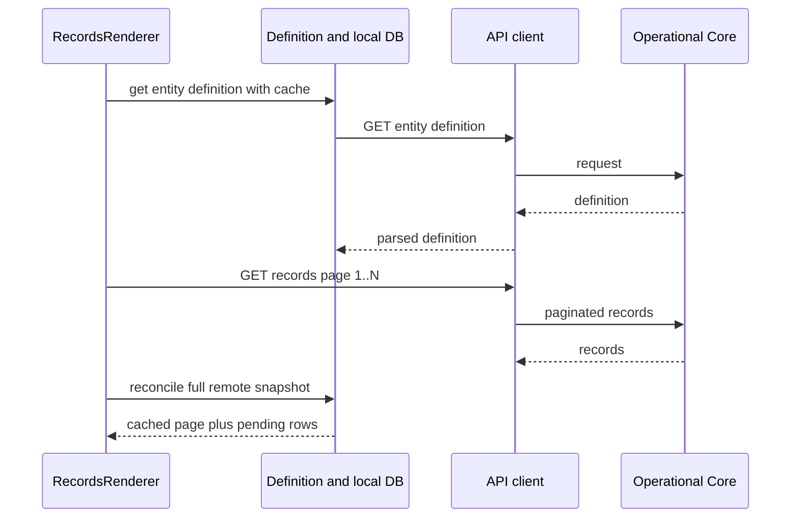

### B. Offline RECORDS Load

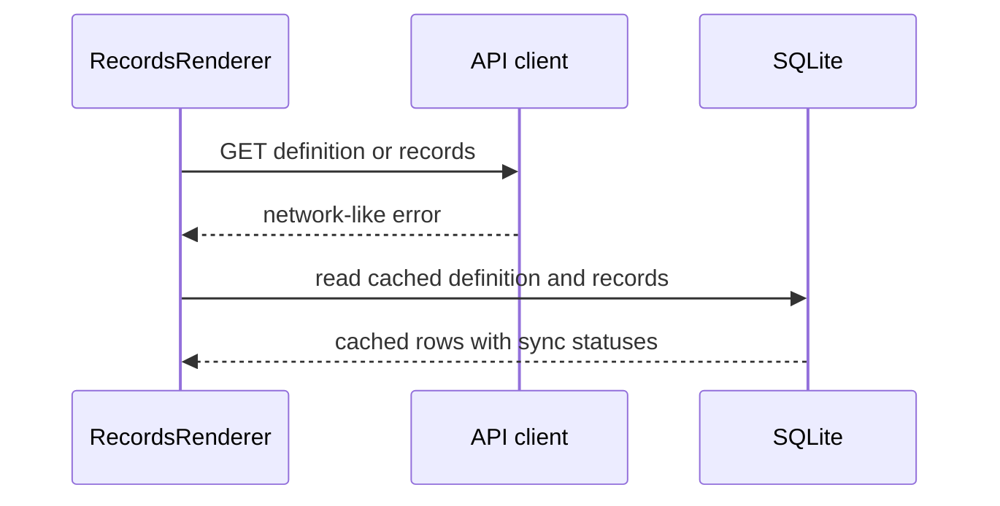

### C. Online State Update

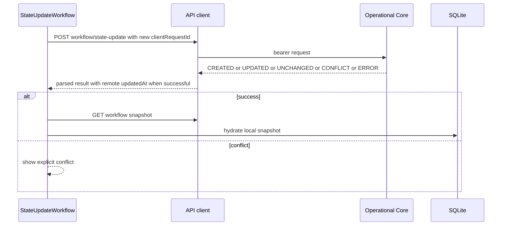

### D. Offline State Update And Reconnect

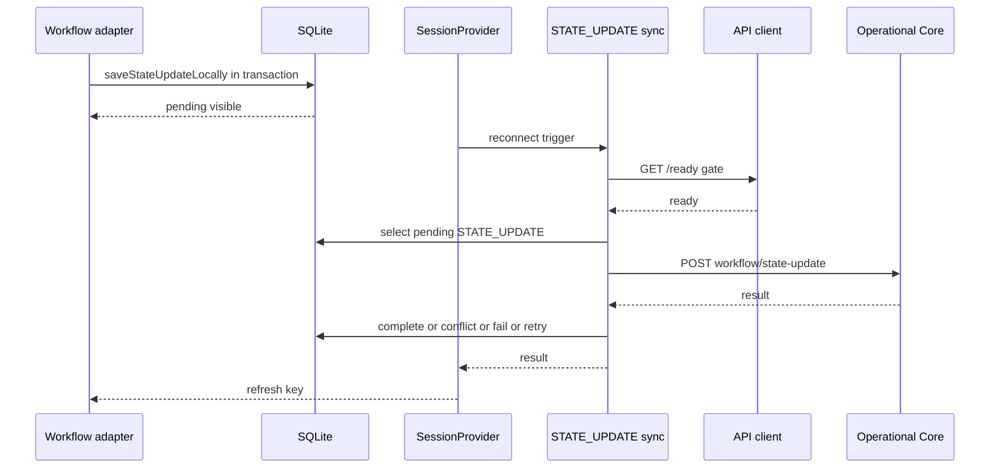

### E. Timeout And Remote Reconcile

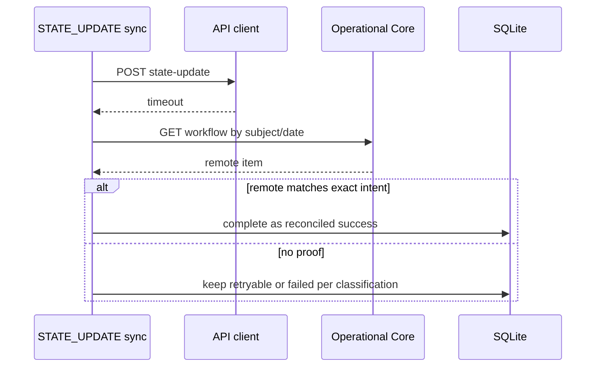

### F. Remote Delete To Online Reconcile To Offline

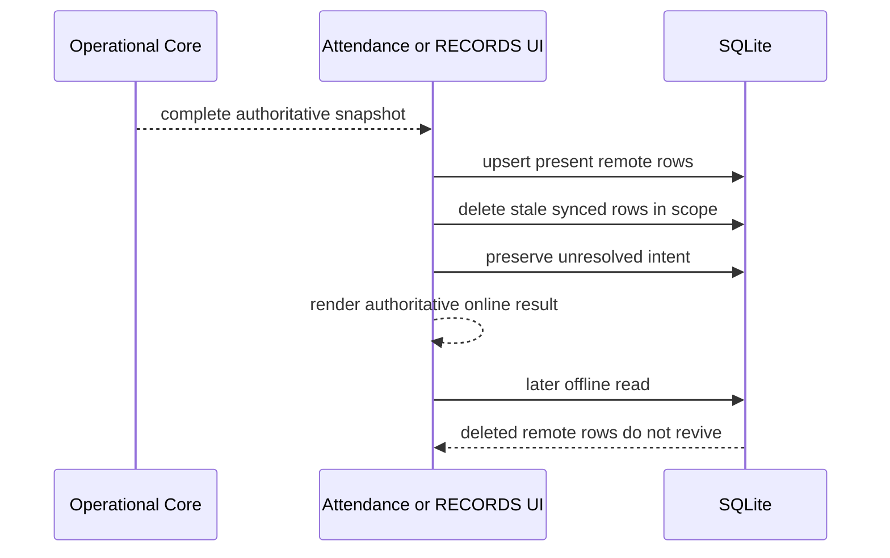

### G. Offline Cold Start

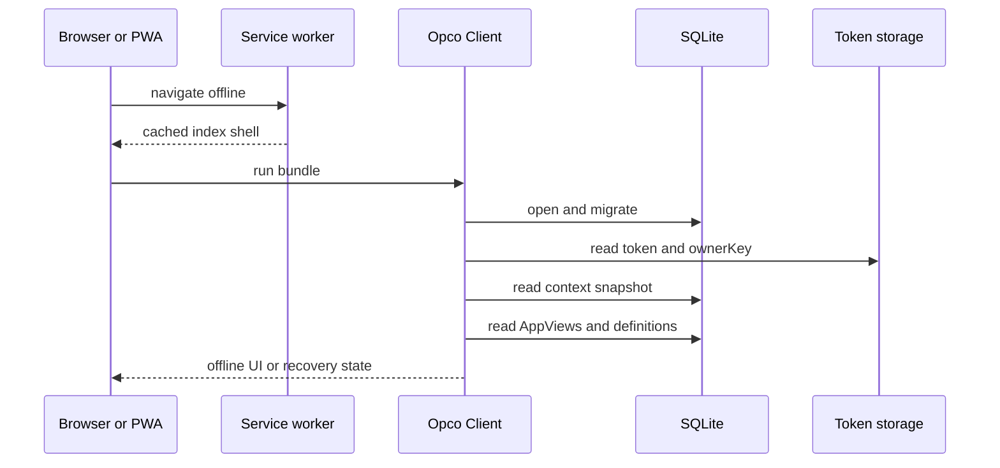

## Architecture Invariants

| # | Invariant | Status |
| --- | --- | --- |
| 1 | Operational Core is source of truth online. | IMPLEMENTED |
| 2 | SQLite is cache plus unresolved local intent, not another authority. | IMPLEMENTED |
| 3 | Pending local intent is not deleted by remote absence. | IMPLEMENTED |
| 4 | Partial/search response is not an authoritative snapshot. | IMPLEMENTED |
| 5 | Destructive reconcile can only use a complete successful remote snapshot. | IMPLEMENTED |
| 6 | Local scope includes owner and contract for cached operational data and unresolved intent. | IMPLEMENTED |
| 7 | Remote EntityRecord identity is `ownerKey + contractId + entityTypeId + serverId`; AppView/date belong to workflow intent, not remote record identity. | IMPLEMENTED |
| 8 | Service worker does not manage business data. | IMPLEMENTED |
| 9 | Connectivity does not prove backend write success or failure. | IMPLEMENTED |
| 10 | RECORDS and STATE_UPDATE sync engines are single-flight. | IMPLEMENTED |
| 11 | Sync orchestration is coordinated before refresh where pending work exists. | IMPLEMENTED |
| 12 | AppView definition prewarm and data cache are separate concepts. | IMPLEMENTED |
| 13 | Diagnostic observation is passive; explicit operator commands may invoke existing recovery/sync commands. | IMPLEMENTED |
| 14 | `remote_updated_at` comes from the backend for confirmed remote versions. | IMPLEMENTED |
| 15 | State-update `clientRequestId` represents immutable intent. | IMPLEMENTED |
| 16 | Attendance is a workflow adapter, not a separate engine. | IMPLEMENTED |
| 17 | SQLite reset is explicit and warns about pending work. | IMPLEMENTED |
| 18 | RECORDS local create/update intent, remote completion, conflict, and failure transitions are atomic between `entity_records` and `pending_operations`. | IMPLEMENTED |
| 19 | RECORDS outbox consistency issues are detectable without exposing raw identifiers or silently repairing data. | IMPLEMENTED |
| 20 | Session lifecycle sync details are extracted from SessionProvider while preserving pending-work order and single-flight engines. | IMPLEMENTED |
| 21 | Local database recovery controller is extracted; reset remains explicit and local-only. | IMPLEMENTED |
| 22 | Session diagnostics wiring is extracted; observation remains passive and commands remain explicit. | IMPLEMENTED |
| 23 | Web shell emits restrictive security headers including CSP, COOP, COEP, Referrer-Policy, and MIME-sniffing protection. | IMPLEMENTED |
| 24 | An AppView is advertised as offline-ready only when both its renderer definition and required local data have been successfully hydrated. | IMPLEMENTED |
| 25 | Generic conflict UI covers RECORDS field diffs but state-update extra diff is incomplete. | PARTIAL |
| 26 | `SessionProvider` still concentrates auth/context/contract/prewarm/recovery UI/refresh-key composition. | PARTIAL |
| 27 | README architecture matches the current workflow implementation. | PARTIAL |

## Known Complexity And Technical Debt

| Area | Issue | Concrete risk | Priority | Recommended action | Blocks production |
| --- | --- | --- | --- | --- | --- |
| SessionProvider | Owns auth, context, selected contract, recovery UI, refresh keys, prewarm kick-off, and public context composition. Lifecycle/recovery/diagnostics controllers are extracted. | Auth/context/prewarm changes can still affect visible app composition. | P2 | Extract contract/prewarm composition only if concrete duplication or regressions reappear. | No |
| Global sync orchestration | Pending engine order lives in `syncPendingWork`; lifecycle details live in `use-pending-work-lifecycle`; refresh keys remain in `SessionProvider`. | Refresh-key API still couples renderers to provider state. | P3 | Keep facade thin; only extract refresh signals if consumers grow. | No |
| State-update conflict UI | Generic extra field diff is not complete. | Users may not see full extra-value differences. | P2 | State Update 1.1 conflict diff/resolution UI. | No |
| README drift | README still contains older unsupported-workflow statements. | New contributors may trust stale docs. | P3 | Update README to point to this doc and `docs/STATE_UPDATE.md`. | No |
| Web token storage | Web access token is in localStorage; refresh token is HttpOnly cookie. CSP now limits executable origins and blocks `unsafe-eval`, but `style-src 'unsafe-inline'` remains required by Expo/RN Web. | XSS exposure of access token if attacker-controlled JavaScript executes in the page. | P2 | Evaluate BFF/cookie-only access strategy for web; remove inline style requirement if Expo/RN Web supports nonced styles later. | No |
| Multi-tab OPFS | Expo SQLite Web may hit `ACCESS_HANDLE_BUSY`. | Second tab can show recovery/busy state. | P2 | Keep UX guidance; consider explicit single-tab lock messaging. | No |
| AppView data prewarm semantics | Workflow source records are prewarmed, RECORDS data is demand-cached, and Home now distinguishes definition readiness from data readiness. | Readiness still means usable known local data, not freshness to the second. | P3 | Keep readiness labels precise as new renderers are added. | No |
| Diagnostics spread | State-update diagnostics wiring is centralized in `use-session-diagnostics`, but the panel is still rendered from provider and route. | UI drift risk. | P3 | Keep shared logic; avoid duplicating panel behavior. | No |
| Unsupported BOARD/DASHBOARD | AppView types exist but render unsupported. | Assigned views may not be usable. | P3 | Implement only when product requires. | No |
| Contract/entity permissions | Backend stage uses contract membership, not granular entity permissions. | AppView visibility is not full data authorization. | P3 | Track backend permission model separately. | No |

## Diagram Entities

### Executive Nodes

| Node | Layer | Role | Connections | Importance |
| --- | --- | --- | --- | --- |
| User UI | UI | Visible app routes and renderers. | SessionProvider, AppViews. | High |
| SessionProvider | Lifecycle | Auth/context/sync coordination. | API, SQLite, Connectivity, Sync. | High |
| AppViews | Runtime | Assigned experiences. | Registry, caches, Operational Core. | High |
| Renderer Registry | Runtime | Chooses renderer. | RECORDS, STATE_UPDATE, Attendance. | Medium |
| RECORDS Runtime | Runtime | Dynamic entity CRUD. | SQLite, API, RECORDS sync. | High |
| STATE_UPDATE Runtime | Runtime | Generic operational state changes. | SQLite, outbox, sync, API. | High |
| Attendance Adapter | Workflow adapter | Attendance UX over STATE_UPDATE. | STATE_UPDATE, Personas cache. | High |
| SQLite | Persistence | Cache and unresolved intent. | Entity records, outbox, metadata. | High |
| Outbox | Persistence | Pending writes. | Sync engines, SQLite. | High |
| Sync Engines | Sync | Push/reconcile pending work. | API, SQLite. | High |
| API Client | Boundary | Authenticated `/api/v1` requests. | Operational Core. | High |
| Operational Core | Backend | Online source of truth. | API Client. | High |
| PWA Shell | Runtime | Offline static shell. | Browser, UI. | Medium |
| Diagnostics | Observability and explicit operator actions. | Passive state/timing visibility; buttons can invoke existing sync/recovery commands. | SessionProvider, SQLite, API wrappers. | Medium |

### Technical Nodes

| Node | Layer | Role | Connections | Importance |
| --- | --- | --- | --- | --- |
| Expo Router | UI | Route tree. | SessionProvider, renderers. | High |
| Login route | UI | Credential login. | SessionProvider, API. | Medium |
| Home route | UI | Contract/AppView menu. | AppView cache, PWA readiness. | High |
| View route | UI | Generic AppView route. | `useAppView`, registry. | High |
| `useAppView` | AppView runtime | Loads assigned view list. | API/cache. | High |
| `app_views` | SQLite cache | Assigned AppViews snapshot. | Home/view route. | High |
| `app_view_definitions` | SQLite cache | Prepared renderer definitions. | Prewarm, offline workflows. | High |
| `entity_definitions` | SQLite cache | Dynamic field definitions. | RECORDS/forms/workflows. | High |
| RecordsRenderer | Runtime | RECORDS list/search/refresh. | offline-records, API, SQLite. | High |
| Record forms | UI/domain | Dynamic create/edit. | record-form, offline-records. | High |
| Record conflict screen | UI/domain | Resolve RECORDS conflicts. | API, SQLite. | Medium |
| StateUpdateWorkflow | Runtime | Generic state-update UI. | state-update offline/sync. | High |
| AttendanceWorkflow | Adapter | Attendance-specific UX. | state-update offline/sync, Personas cache. | High |
| `entity_records` | SQLite | Renderable rows and local intent state. | RECORDS, STATE_UPDATE. | High |
| `pending_operations` | SQLite | Shared outbox. | Sync engines. | High |
| `sync_telemetry` | SQLite | Sync phase timestamps. | RECORDS/STATE_UPDATE diagnostics. | Medium |
| `app_metadata` | SQLite | Schema, selected contract, diagnostics telemetry. | SessionProvider/local DB. | Medium |
| Local DB singleton | Persistence | Open/migrate/recover SQLite. | expo-sqlite. | High |
| Local DB recovery controller | Recovery | Storage-state subscription, retry/reset callbacks, reset guidance. | SessionProvider, Local DB recovery helpers. | Medium |
| Recovery screen | UI/recovery | Retry/reset local storage. | Local DB recovery summary. | Medium |
| Token storage | Persistence/auth | Access/refresh token storage. | API auth. | High |
| API client | Boundary | Fetch, timeout, refresh, parsing. | Operational Core. | High |
| Records sync | Sync | CREATE/UPDATE outbox engine. | API, SQLite. | High |
| State-update sync | Sync | STATE_UPDATE outbox engine. | API, SQLite. | High |
| Pending-work lifecycle hook | Lifecycle | Reconnect, unknown-to-online, foreground/resume, manual pending-work callback, stale-run guards. | Reconnect controller, syncPendingWork, SessionProvider. | Medium |
| Reconnect controller | Lifecycle | Debounced offline/unknown to online sync. | Connectivity, SessionProvider. | Medium |
| PWA service worker | Runtime | Shell cache and navigation fallback. | Browser Cache Storage. | Medium |
| Session diagnostics hook | Observability | State-update diagnostics state, passive refresh, explicit sync/retry commands, reconnect telemetry. | SessionProvider, diagnostics route logic, SQLite. | Medium |
| State-update diagnostics | Observability | Outbox/reconnect/request inspection. | SQLite, API wrappers. | Medium |
| Operational Core API | Backend | Source of truth and idempotency. | PostgreSQL/Prisma backend. | High |
