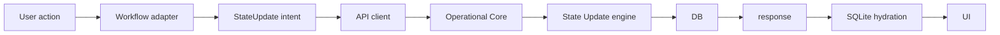
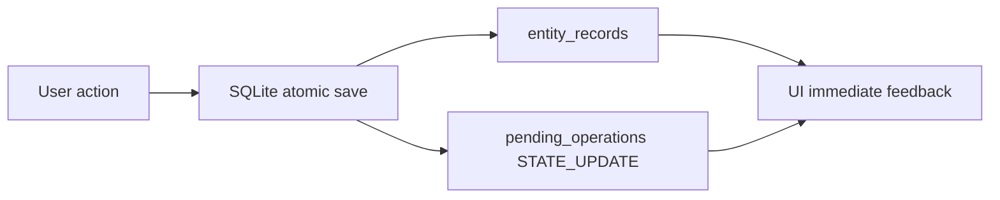
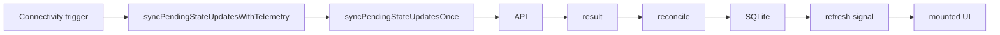
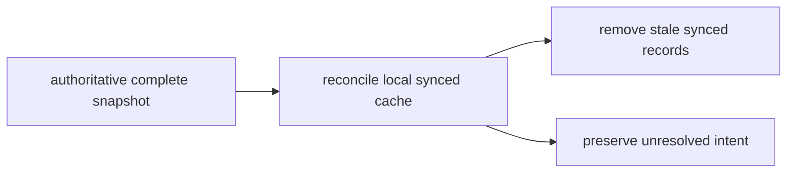

# State Update

This document is the canonical client-side reference for the current `STATE_UPDATE` architecture in Opco Client. It describes the code as it exists now, including implementation gaps against the newer Operational Core contract.

Read this before changing the state-update runtime, offline persistence, outbox, reconnect orchestration, reconciliation, conflicts, workflow adapters, or diagnostics.

## Model

Opco / Operational Core is the online source of truth. SQLite is a local cache plus durable storage for unresolved local intent. `pending_operations` is the shared outbox. `STATE_UPDATE` is the generic workflow primitive for operational state changes.

Attendance is an adapter/preset over `STATE_UPDATE`. It has workflow-specific UX, labels, status mapping, and legacy GET adaptation, but it does not own a separate sync engine, outbox, retry loop, conflict engine, or persistence engine.

## Flow Diagrams

Online:



Offline:



Reconnect:



Timeout:


Remote deletion:



## Sources Of Truth

| Situation | Source of truth | Local behavior |
| --- | --- | --- |
| Online | Backend | Render backend response and hydrate SQLite. |
| Offline | SQLite snapshot | Render cached data and unresolved local intent. |
| Local pending | Local intent | Preserve the intent until sync, conflict, failure, or explicit user resolution. |
| Conflict | Backend remote snapshot plus local requested intent | Keep both snapshots and require explicit choice. |
| Timeout unknown | Unknown | Do not assume failure or success; verify remotely when possible. |
| Remote confirmed | Backend state | Complete the pending operation and mark local snapshot `synced`. |

Backend online state must not later be replaced by a stale or partial SQLite snapshot.

## StateUpdateIntent

A logical `StateUpdateIntent` includes:

- `appViewId`
- `subjectRecordId`
- optional `date`
- `stateValues`
- `extraValues`
- `clientRequestId`
- `overwrite`
- `expectedUpdatedAt`, when conflict resolution needs it
- `uniqueness` and `historyMode`, derived from the prepared AppView definition

The client uses `stateValues` internally. The wire payload to Operational Core uses `states` conceptually, while the current client API wrapper accepts `stateValues` and translates it at the API boundary. Do not mix internal and wire names outside that boundary.

## Client Request ID

The official backend contract is that `clientRequestId` identifies one immutable intention:

- retrying the same intention uses the same ID;
- changing state uses a new ID;
- changing extra values uses a new ID;
- confirming overwrite uses a new ID;
- a new attempt after a stale conflict uses a new ID.

Current implementation:

- Online saves create a fresh `clientRequestId` for each explicit save action.
- Offline saves persist the ID in `pending_operations` and preserve it across retries.
- Repeated offline `update-current` saves for the same subject/date consolidate into the existing pending operation.
- If the consolidated payload is the same semantic intention, the existing `clientRequestId` is preserved.
- If the consolidated payload changes states, extras, overwrite, or expected version, the pending operation keeps one local row but rotates to a new `clientRequestId`.
- Confirming an online conflict calls a fresh save action and therefore creates a new `clientRequestId`.

## SQLite Persistence

Relevant tables:

- `entity_records`: renderable local snapshots, remote IDs, remote version, conflict snapshots, and `sync_status`.
- `pending_operations`: durable outbox for `CREATE`, `UPDATE`, and `STATE_UPDATE`.
- `app_metadata`: schema version, selected contract, and persisted state-update diagnostics.
- `app_view_definitions`: prepared workflow/runtime metadata by `owner_key + contract_id + app_view_id`.
- `sync_telemetry`: sync phase and timestamps. `STATE_UPDATE` uses `workflow:<appViewId>` as the telemetry entity key.

Offline `STATE_UPDATE` save is atomic: the local `entity_records` snapshot and the `pending_operations` row are written in the same SQLite transaction.

`local_id` is scoped. For `update-current` with `subject` or `subject-date` uniqueness, it is derived from `appViewId`, optional date, and `subjectRecordId`. For append/no-uniqueness records it is generated from the AppView plus time/randomness.

## Sync Statuses

| Status | Meaning for STATE_UPDATE | Auto-sync |
| --- | --- | --- |
| `pending_create` | Technical shared-infra name for pending intent. | Eligible. |
| `pending_update` | Technical shared-infra name for pending intent. | Eligible. |
| `syncing` | Operation was selected and may have been interrupted. | Eligible according to current retry/reconnect policy. |
| `synced` | Local snapshot matches last known remote state. | Not an outbox item. |
| `failed` | Non-auto-retryable failure or manual retry required. | Not automatic. |
| `conflict` | Backend returned a conflict snapshot. | Not automatic. |

`pending_create` and `pending_update` are inherited database names from the shared records infrastructure. Conceptually, both are pending state-update intent.

## Orchestration

All automatic state-update sync execution goes through `syncPendingStateUpdatesWithTelemetry()` in `SessionProvider`, which wraps the internal engine `syncPendingStateUpdatesOnce()`. Combined pending-work runs use `syncPendingWork()` to keep the global engine order as RECORDS first, then STATE_UPDATE; lifecycle decisions still belong to `SessionProvider`.

Current triggers:

- reconnect
- unknown-to-online
- startup-with-pending
- foreground/resume
- manual retry

The sync engine is single-flight. Failed and conflict rows are excluded from automatic retry by current policy; manual retry is explicit.

Each combined pending-work execution creates a local `syncRunId`. It is not sent to Operational Core. It exists to correlate lifecycle trigger, state-update sync telemetry, request diagnostics, and visible UI diagnostics.

## Connectivity

Current connectivity classification:

- `isConnected === false` or `isInternetReachable === false` means `offline`.
- `isConnected === true` means `online`, even if reachability is `null`.
- both values unknown/null means `unknown`.

The client bootstraps with `NetInfo.fetch()` and then listens to NetInfo changes.

Connectivity is an orchestration signal, not a source of truth about the result of a write. A timeout or network transition does not prove that Operational Core failed to persist a command.

## Timeout

The API client timeout is `12_000 ms`.

Timeout does not mean write failed. For state-update sync, a timed-out POST may still have been committed by Operational Core. Current sync then attempts remote verification through `getStateUpdateWorkflow({ date, subjectRecordId })`. If the remote item exactly matches the pending payload, the operation is completed locally and telemetry reports `reconciled_success`. If remote confirmation is unavailable or does not match, the pending operation remains unresolved under the retry/failure policy.

The UI should not keep a stale error once later remote verification confirms success.

A timeout from a GET refresh after a confirmed write is a view-refresh problem, not proof that the write failed. Workflow UI keeps operation feedback separate from refresh feedback so a confirmed local/remote write does not render the generic timeout as a write failure.

## Exact Reconciliation

Backend State Update 1.0 treats an intention as matching only when every submitted field matches after canonical normalization:

- `stateValues`
- `extraValues`
- omitted fields do not participate
- explicit `null` participates
- `RELATION` compares target record ID
- `SELECT` compares option ID
- `DATE` compares `YYYY-MM-DD`
- `TIME` compares `HH:mm`
- other values compare their canonical API representation

Current client implementation centralizes exact matching in the state-update offline helper. Timeout recovery, snapshot repair, and local reconciliation use the same semantic comparison:

- requested state fields compare by `fieldId + optionId`;
- requested extras compare by field key and canonical value;
- omitted extras are ignored;
- explicit `null`, `false`, `0`, and `""` are preserved as requested values;
- relation-like objects compare by target record `id`;
- labels, display names, and other visual text do not determine equality.

## UpdatedAt

Operational Core State Update 1.0 returns the real remote `updatedAt`. Client `remote_updated_at` should come from the server and must not use client time as a substitute for a remote version.

Current implementation:

- Successful remote sync requires server-provided IDs and `updatedAt`.
- Snapshot hydration stores `item.current.updatedAt`.
- Attendance latest adaptation requires `latest.updatedAt`.
- If a successful state-update response lacks a valid ISO `updatedAt`, the API wrapper raises a controlled contract error instead of inventing a version.
- `cached_at` remains local cache metadata and is distinct from `remote_updated_at`.

## Snapshot Reconciliation

`upsertStateUpdateSnapshot()` now supports complete snapshot reconciliation.

For a complete remote snapshot, the client:

1. upserts remote records that are present;
2. finds local records in the same `owner + contract + appView + date + targetEntityType` scope;
3. removes only local `synced` records absent from the remote snapshot;
4. preserves unresolved local intent.

Never delete these statuses due only to remote absence:

- `pending_create`
- `pending_update`
- `syncing`
- `failed`
- `conflict`

This handles confirmed remote deletions without creating pending operations, recreating remote records, or marking local rows failed.

## Complete Vs Partial Snapshot

Attendance GET has a backend `latest` limit of 10. The client centralizes that limit as `ATTENDANCE_LATEST_LIMIT`.

An Attendance day can be treated as complete only when:

```text
summary.totalRegistered <= ATTENDANCE_LATEST_LIMIT
AND
latest.length === summary.totalRegistered
```

Search and `personRecordId` responses are passed to SQLite with `complete=false`.

If `summary.totalRegistered > 10`, `latest` is not a complete snapshot and must not be used for destructive cleanup by absence. This heuristic depends on the current backend `latest take=10` contract.

## Remote Deletions

Confirmed remote deletion through a complete snapshot means local `synced` cache for that record should be removed. It should not create a pending operation, recreate the remote record, or mark the local snapshot `failed`.

Unresolved local intent is preserved. This guarantees that an online authoritative snapshot is reflected in later offline reads.

## Conflicts

A conflict contains:

- existing remote state;
- requested local intent;
- differences;
- `expectedUpdatedAt`;
- optional overwrite confirmation.

Backend differences now distinguish `kind=state` and `kind=extra`.

Overwrite is a new semantic intention and requires a new `clientRequestId`. The original conflict probe should keep its original key if retried; the overwrite confirmation should not reuse it.

IMPLEMENTATION GAP: client conflict UI is still primarily state/status oriented. Generic `state-update` extras and Attendance observation are submitted, but conflict rendering/resolution does not yet present a full field-by-field extra diff equivalent to the backend contract.

## Idempotency Errors

Backend idempotency errors:

- `IDEMPOTENCY_KEY_REUSED`: the same key was used with a different semantic payload. The client must not auto-retry with that same key.
- `IDEMPOTENCY_RESULT_UNAVAILABLE`: the backend has a historical or incomplete idempotency row without a durable response. The client must not silently generate a new key, especially for append-style commands where that could duplicate records.

Current implementation handles these codes explicitly:

- `IDEMPOTENCY_KEY_REUSED` fails the local operation for manual recovery and does not auto-retry with a new key.
- `IDEMPOTENCY_RESULT_UNAVAILABLE` attempts exact remote reconciliation only for `update-current` scopes where a single current record can be verified by `subject + date`. If the remote state and extras match, the operation completes as `reconciled_success`.
- Append/no-uniqueness operations do not auto-reconcile or rotate keys on `IDEMPOTENCY_RESULT_UNAVAILABLE`, because a GET snapshot cannot prove which append event was committed.

## Attendance Adapter

Attendance maps to `STATE_UPDATE` like this:

| Attendance | State Update |
| --- | --- |
| person | subject |
| status | state |
| observation | extra |
| date | date |
| uniqueness | `subject-date` |
| history mode | `update-current` |

Attendance may keep UX-specific text, status buttons, and the legacy GET adapter. It must not own separate sync/storage/conflict semantics.

The compatible workflow family is named by `isStateUpdateCompatibleWorkflow()`. Current compatible keys are:

- `state-update`
- `attendance`

Known compatibility branches that still mention Attendance outside the adapter boundary:

- workflow registry resolution for `workflowKey === "attendance"`;
- app-view definition preparation/cache readiness for Attendance;
- Attendance prewarm of source Personas;
- diagnostics summarizing Attendance GET responses;
- local diagnostics that classify Attendance-derived pending rows.

These branches are current compatibility glue, not a separate Attendance engine.

## UI Refresh

`stateUpdateReconnectRefreshKey` signals mounted workflows after meaningful state-update sync. The intended flow is:

```text
sync -> local reconcile -> refresh signal -> mounted StateUpdateWorkflow/Attendance -> reload state
```

The refresh should not require remounting and should not trigger another sync loop. `shouldEmitStateUpdateRefresh()` emits only after selected or completed/conflict/failed/retriable state-update work; `shouldHandleStateUpdateRefresh()` handles each emitted key once and skips initial mount.

## Diagnostics

Diagnostics distinguish:

- current connectivity;
- last reconnect;
- last `STATE_UPDATE` activity, including snapshot reconciliation;
- last meaningful `STATE_UPDATE` sync;
- last visible UI error event;
- current outbox;
- workflow local records;
- consistency;
- recovery state.

Telemetry is persisted in `app_metadata` under `state_update_sync_diagnostics:<fingerprinted ownerKey>`, avoids PII, and diagnostic observation must not change runtime behavior. The last meaningful state-update sync preserves sanitized POST request diagnostics when they exist: `syncRunId`, `requestStartedAt`, `fetchResolvedAt`, `responseBodyStartedAt`, `responseParsedAt`, `requestDurationMs`, `timeoutMs`, `abortControllerTriggered`, `httpStatus`, and template path. Timeout evidence is preserved even when exact remote reconciliation later completes the local operation as `reconciled_success`. Explicit operator commands from diagnostics, such as manual retry or sync now, may invoke the existing sync/recovery commands after a user action. Diagnostic event construction for manual state-update sync is shared between `SessionProvider` and `app/(app)/diagnostics/state-update.tsx`.

`Last STATE_UPDATE activity` is separate from `Last STATE_UPDATE sync`. A real sync engine run writes both, with activity `type=sync`. Snapshot reconciliation through `upsertStateUpdateSnapshot()` may complete pending local intent without a POST sync run; that writes activity `type=snapshot_reconciliation` and does not invent a new `Last STATE_UPDATE sync`.

`Last visible UI error` is historical. The current visible error may disappear after success, refresh, navigation, or remount, but diagnostics keep the last sanitized event with `occurredAt`, optional `clearedAt`, `operation`, HTTP method, path template, duration, timeout flag, HTTP status, error code, optional `syncRunId`, and resolution such as `unresolved`, `cleared_after_success`, or `refresh_failed`. It must not persist user-facing messages, payloads, tokens, raw IDs, names, or form values.

Reconnect detection is persisted when connectivity transitions from `offline` or `unknown` to `online`, even if there is no pending work to sync. A transition can therefore update `Last reconnect` without producing a new `Last STATE_UPDATE sync` run.

## Recovery Invariants

- Remote exact confirmed means local state can become `synced`.
- A real pending operation is not overwritten by a remote snapshot that does not match it.
- No pending operation plus no remote record is an orphan/recovery condition.
- Timeout plus exact remote confirmation becomes `reconciled_success`.
- `outbox=0` plus local pending records is a detectable consistency mismatch.
- `failed` and `conflict` are not automatic retries.
- Interrupted `syncing` state-update rows are eligible under current retry/reconnect policy.

## Invariant Checklist

| # | Invariant | Status |
| --- | --- | --- |
| 1 | Opco is source of truth online. | IMPLEMENTED |
| 2 | SQLite is cache plus unresolved local intent. | IMPLEMENTED |
| 3 | Offline save is atomic. | IMPLEMENTED |
| 4 | `clientRequestId` represents an immutable intention. | IMPLEMENTED |
| 5 | Retries do not change `clientRequestId`. | IMPLEMENTED |
| 6 | A modified intention rotates `clientRequestId`. | IMPLEMENTED |
| 7 | No pending intent is deleted without explicit resolution. | IMPLEMENTED |
| 8 | A partial snapshot never deletes by absence. | IMPLEMENTED |
| 9 | A complete snapshot may delete only stale `synced` rows. | IMPLEMENTED |
| 10 | Snapshot reconciliation never overwrites unresolved intent. | IMPLEMENTED |
| 11 | Reconcile compares states plus extras. | IMPLEMENTED |
| 12 | `remote_updated_at` comes from the backend. | IMPLEMENTED |
| 13 | Combined pending-work sync uses one engine-order facade; state-update sync uses one telemetry wrapper. | IMPLEMENTED |
| 14 | Diagnostic observation is passive; explicit operator commands may invoke existing recovery/sync commands. | IMPLEMENTED |
| 15 | Attendance is an adapter, not an engine. | IMPLEMENTED |

## State Update 1.0 Readiness

Implemented client-side readiness for State Update 1.0:

- immutable `clientRequestId` semantics for retries vs modified intentions;
- exact reconciliation across requested states and extras;
- server-owned `updatedAt` as the only remote version;
- complete snapshot reconciliation for remote deletions;
- explicit handling for backend idempotency errors;
- centralized compatible workflow detection for `state-update` and `attendance`.

Remaining implementation gap:

- conflict UI still does not present a complete generic extra diff equivalent to the backend conflict payload.

## Architecture Entities For System Diagram

Stable nodes and boundaries for a later system diagram:

- `SessionProvider`: owns auth/session state, selected contract, reconnect orchestration, sync telemetry helpers, and refresh signals.
- `Connectivity`: NetInfo-derived online/offline/unknown signal.
- `AppView Definition Cache`: prepared runtime metadata by owner/contract/AppView.
- `Workflow Registry`: routes `WORKFLOW` AppViews by `workflowKey`.
- `StateUpdateWorkflow`: generic state-update UI/runtime.
- `Attendance Adapter`: Attendance-specific UX and mapping onto `STATE_UPDATE`.
- `SQLite`: local cache and outbox store.
- `entity_records`: renderable snapshots plus local state-update intent rows.
- `pending_operations`: durable outbox for unresolved writes.
- `sync orchestrator`: `syncPendingStateUpdatesWithTelemetry()` and `syncPendingStateUpdatesOnce()`.
- `API client`: authenticated `/api/v1` boundary, timeout, envelope parsing.
- `Operational Core`: authoritative backend and state-update engine.
- `telemetry`: persisted sync diagnostics and recovery summaries.
- `diagnostics`: UI/route views for non-sensitive operational inspection.
- `refresh signals`: mounted workflow refresh after sync.
- `Service Worker/PWA`: offline app shell only, not API data cache.
- `RECORDS engine`: separate generic records renderer/sync system that shares SQLite infrastructure.
