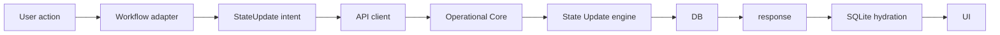
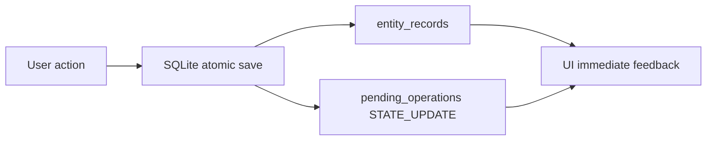
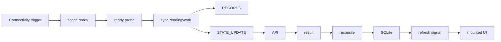
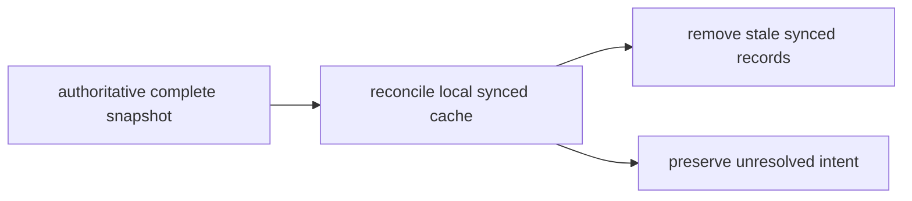

# State Update

This document is the canonical client-side reference for the current `STATE_UPDATE` architecture in Opco Client. It describes the code as it exists now, including implementation gaps against the newer Operational Core contract.

Read this before changing the state-update runtime, offline persistence, outbox, reconnect orchestration, reconciliation, conflicts, workflow adapters, or diagnostics.

## Model

Opco / Operational Core is the online source of truth. SQLite is a local cache plus durable storage for unresolved local intent. `pending_operations` is the shared outbox. `STATE_UPDATE` is the generic workflow primitive for operational state changes.

Attendance is an adapter/preset over `STATE_UPDATE`. It has workflow-specific UX, labels, status mapping, and legacy GET adaptation, but it does not own a separate sync engine, outbox, retry loop, conflict engine, or persistence engine.

Attendance day summaries and recent records are scoped by owner, contract, target entity, AppView,
and the selected attendance `date`. Local filtering uses the persisted logical attendance date in
`values_json`, never `cached_at`, creation time, or modification time. The remote Attendance endpoint
receives the same selected date. Recent results are limited (remote latest: 10; local page: 20) and
ordered newest-known first. A request that finishes after the user selects another date may finish
hydrating its own cache scope, but cannot update the visible day.

## Flow Diagrams

Online:


```mermaid
flowchart LR
  A[User action] --> B[Workflow adapter]
  B --> C[StateUpdate intent]
  C --> D[API client]
  D --> E[Operational Core]
  E --> F[State Update engine]
  F --> G[DB]
  G --> H[response]
  H --> I[SQLite hydration]
  I --> J[UI]
```

Offline:


```mermaid
flowchart LR
  A[User action] --> B[SQLite atomic save]
  B --> C[entity_records]
  B --> D[pending_operations STATE_UPDATE]
  C --> E[UI immediate feedback]
  D --> E
```

Reconnect:


```mermaid
flowchart LR
  A[Connectivity trigger] --> B[scope ready]
  B --> C[ready probe]
  C --> D[syncPendingWork]
  D --> E[RECORDS]
  D --> F[STATE_UPDATE]
  F --> G[API]
  G --> H[result]
  H --> I[reconcile]
  I --> J[SQLite]
  J --> K[refresh signal]
  K --> L[mounted UI]
```

Timeout:


```mermaid
flowchart LR
  A[POST] --> B[12s timeout]
  B --> C[remote confirmation]
  C --> D[exact reconcile]
  D --> E[reconciled_success OR unresolved]
```

Remote deletion:


```mermaid
flowchart LR
  A[authoritative complete snapshot] --> B[reconcile local synced cache]
  B --> C[remove stale synced records]
  B --> D[preserve unresolved intent]
```

## Sources Of Truth

| Situation | Source of truth | Local behavior |
| --- | --- | --- |
| Online | Backend | Render backend response and hydrate SQLite. |
| Offline | SQLite snapshot | Render cached data and unresolved local intent. |
| Local pending | Local intent | Preserve the intent until sync, conflict, failure, or explicit user resolution. |
| Conflict | Backend remote snapshot plus local requested intent | Keep both snapshots and require explicit choice. |
| Timeout unknown | Unknown | Do not assume failure or success; verify remotely when possible. |
| Remote confirmed | Backend state | Complete the pending operation and mark local snapshot `synced`. |

Backend online state must not later be replaced by a stale or partial SQLite snapshot.

## StateUpdateIntent

A logical `StateUpdateIntent` includes:

- `appViewId`
- `subjectRecordId`
- optional `date`
- `stateValues`
- `extraValues`
- `clientRequestId`
- `overwrite`
- `expectedUpdatedAt`, when conflict resolution needs it
- `uniqueness` and `historyMode`, derived from the prepared AppView definition

The client uses `stateValues` internally. The wire payload to Operational Core uses `states` conceptually, while the current client API wrapper accepts `stateValues` and translates it at the API boundary. Do not mix internal and wire names outside that boundary.

For generic `GET workflow/state-update`, Operational Core's documented response uses `subjects` as the search result collection and `states` as the current/latest state map. The Client keeps its internal renderer model as `items` plus `stateValues`; `src/lib/opco-api.ts` is the boundary adapter that maps `subjects -> items`, `subjectEntityType -> sourceEntityType`, and `states -> stateValues`. SELECT state fields carry `optionId`; scalar state fields (`TEXT`, `INTEGER`, `DECIMAL`, `MONEY`, `DATE`, and `BOOLEAN`) carry `value`. Attendance keeps its separate endpoint and `items` response shape.

## Client Request ID

The official backend contract is that `clientRequestId` identifies one immutable intention:

- retrying the same intention uses the same ID;
- changing state uses a new ID;
- changing extra values uses a new ID;
- confirming overwrite uses a new ID;
- a new attempt after a stale conflict uses a new ID.

Current implementation:

- Online saves create a fresh `clientRequestId` for each explicit save action.
- Offline saves persist the ID in `pending_operations` and preserve it across retries.
- Repeated offline `update-current` saves for the same subject/date consolidate into the existing pending operation.
- If the consolidated payload is the same semantic intention, the existing `clientRequestId` is preserved.
- If the consolidated payload changes states, extras, overwrite, or expected version, the pending operation keeps one local row but rotates to a new `clientRequestId`.
- Confirming an online conflict calls a fresh save action and therefore creates a new `clientRequestId`.

## SQLite Persistence

Relevant tables:

- `entity_records`: renderable local snapshots, remote IDs, remote version, conflict snapshots, and `sync_status`.
- `pending_operations`: durable outbox for `CREATE`, `UPDATE`, and `STATE_UPDATE`.
- `app_metadata`: schema version, selected contract, remembered Attendance context selections, Attendance day hydration metadata, and persisted state-update diagnostics.
- `app_view_definitions`: prepared workflow/runtime metadata by `owner_key + contract_id + app_view_id`.
- `sync_telemetry`: sync phase and timestamps. `STATE_UPDATE` uses `workflow:<appViewId>` as the telemetry entity key.

Offline `STATE_UPDATE` save is atomic: the local `entity_records` snapshot and the `pending_operations` row are written in the same SQLite transaction.

Conflict persistence is also atomic: `markStateUpdateOperationConflict()` writes the pending operation error metadata and the associated local `entity_records` conflict snapshot in one SQLite transaction. The successful final shape is unchanged: pending operation has `last_error_code = CONFLICT`, and the local record has `sync_status = conflict` plus remote conflict metadata.

STATE_UPDATE uses the common per-connection SQLite coordinator described in
`CLIENT_ARCHITECTURE.md#sqlite`; it does not own a separate queue. Offline saves, remote snapshot
hydration, outbox completion/conflict, concurrent RECORDS work, prewarm metadata, and direct
telemetry/cache statements therefore cannot enter one another's transaction. Each transaction keeps
its original atomic boundary and propagates failures after SQLite rollback. The coordinator does not
retry or suppress operations, and a rejected operation does not prevent the next queued operation.

`local_id` is scoped. For `update-current` with `subject` or `subject-date` uniqueness, it is derived from `appViewId`, optional date, and `subjectRecordId`. For append/no-uniqueness records it is generated from the AppView plus time/randomness.

## Sync Statuses

| Status | Meaning for STATE_UPDATE | Auto-sync |
| --- | --- | --- |
| `pending_create` | Technical shared-infra name for pending intent. | Eligible. |
| `pending_update` | Technical shared-infra name for pending intent. | Eligible. |
| `syncing` | Operation was selected and may have been interrupted. | Eligible according to current retry/reconnect policy. |
| `synced` | Local snapshot matches last known remote state. | Not an outbox item. |
| `failed` | Non-auto-retryable failure or manual retry required. | Not automatic. |
| `conflict` | Backend returned a conflict snapshot. | Not automatic. |

`pending_create` and `pending_update` are inherited database names from the shared records infrastructure. Conceptually, both are pending state-update intent.

## Orchestration

All automatic state-update sync execution goes through `syncPendingStateUpdatesWithTelemetry()` in `SessionProvider`, which wraps the internal engine `syncPendingStateUpdatesOnce()`. Combined pending-work runs use `syncPendingWork()` to keep the global engine order as RECORDS first, then STATE_UPDATE; lifecycle decisions still belong to `SessionProvider`.

Current triggers:

- reconnect
- unknown-to-online
- startup-with-pending
- foreground/resume
- manual retry

The sync engine is single-flight. Failed and conflict rows are excluded from automatic retry by current policy; manual retry is explicit.

Each combined pending-work execution creates a local `syncRunId`. It is not sent to Operational Core. It exists to correlate lifecycle trigger, state-update sync telemetry, request diagnostics, and visible UI diagnostics.

Automatic reconnect-like triggers are gated by Operational Core readiness before POST sync begins. NetInfo `online` only says the client appears connected; it does not prove Railway/Operational Core is ready to accept authenticated business writes. For `reconnect`, `unknown-to-online`, `startup-with-pending`, and `foreground/resume`, the lifecycle hook first checks durable pending work and then probes `GET /api/v1/ready` with a short independent timeout of `2_500 ms`, at most three attempts, and bounded backoff of `500 ms` then `1_000 ms`. Each `READY_CHECK` attempt is recorded with an `attemptNumber` and the same local `syncRunId`. If readiness never confirms, the client does not send STATE_UPDATE/RECORDS POST requests, leaves pending intent durable and retryable, and records activity as `ready_failed` rather than a business sync failure. A readiness run that has been marked as `reconnecting` must later resolve to `ready_confirmed`, `sync_started`, `ready_failed`, `cancelled_scope_changed`, `interrupted`, or the terminal sync result; persisted orphan `reconnecting` activity without a matching `READY_CHECK` request is treated as `interrupted` on hydration and can be retried by the normal catch-up path.

After an exhausted readiness cycle, if connectivity is still `online`, the app is active, the same owner/contract/token scope is still current, durable pending work remains, and no run is active, the lifecycle schedules a bounded recovery catch-up. Recovery uses delays of `5_000 ms`, `15_000 ms`, `30_000 ms`, then `60_000 ms` as a maximum interval while those conditions remain true. It is cancelled when connectivity leaves `online`, when pending work disappears, when the app backgrounds, or when the session/contract scope changes. Each recovery catch-up creates a new local `syncRunId`; it does not consume business retry count, does not change `clientRequestId`, and does not send a business POST before readiness succeeds.

`GET /api/v1/ready` is public from the client perspective and must not touch session state. It does not send bearer auth, must not initiate refresh, and must not clear tokens. After readiness succeeds, the lifecycle treats auth readiness as a separate pre-business-write gate: if the local access token is expired or within the five minute refresh margin, it runs one `AUTH_REFRESH` with the same local `syncRunId` and a `30_000 ms` timeout before sending pending STATE_UPDATE/RECORDS POSTs. Opaque/unparseable tokens are not proactively refreshed; they fall through to the normal authenticated-request `401 TOKEN_EXPIRED` path. A refresh network error, timeout, `503`, or `DB_UNAVAILABLE` is not evidence of an invalid session and must leave credentials/pending intent recoverable. Automatic logout is allowed only after a backend-confirmed invalid refresh/session condition such as expired, revoked, reused, missing refresh token, inactive refresh user/app, or `TOKEN_INVALID`.

If NetInfo becomes `online` before `ownerKey`, token, and selected contract scope are ready, the scope-ready catch-up path re-checks durable pending work as soon as the missing scope becomes available. This closes the case where the online transition was consumed while `shouldSync()` was false. The catch-up is not polling; repeated renders are deduped for the active scope, and a user/session/contract change is evaluated as a new scope.

Mounted STATE_UPDATE adapters derive their visible runtime model from the canonical session connectivity, durable unresolved intent for the active scope, readiness activity, real pending-work engine activity, timeout reconciliation state, and terminal result. `PENDING` means durable unresolved work exists but no sync engine or readiness probe is currently active. `RECONNECTING` means the readiness gate is actively probing Operational Core in the mounted runtime, not merely that old telemetry says the last activity was `ready_check`. `SYNCING` is reserved for an active `syncPendingWork()`/engine run. `CONFIRMING` is reserved for an in-flight direct write or timeout reconciliation. A renderer must not show `Sin conexion` from a separate NetInfo listener, and must not show `Sincronizando con Opco...` merely because it is online with pending work.

## Connectivity

Current connectivity classification:

- `isConnected === false` or `isInternetReachable === false` means `offline`.
- `isConnected === true` means `online`, even if reachability is `null`.
- both values unknown/null means `unknown`.

The client bootstraps with `NetInfo.fetch()` and then listens to NetInfo changes.

Connectivity is an orchestration signal, not a source of truth about the result of a write. A timeout or network transition does not prove that Operational Core failed to persist a command.

## Timeout

The API client timeout is `12_000 ms`.

Timeout does not mean write failed. For state-update sync, a timed-out POST may still have been committed by Operational Core. Current sync then attempts remote verification through `getStateUpdateWorkflow({ date, subjectRecordId })`. If the remote item exactly matches the pending payload, the operation is completed locally and telemetry reports `reconciled_success`. If remote confirmation is unavailable or does not match, the pending operation remains unresolved under the retry/failure policy.

The UI should not keep a stale error once later remote verification confirms success.

A timeout from a GET refresh after a confirmed write is a view-refresh problem, not proof that the write failed. Workflow UI keeps operation feedback separate from refresh feedback so a confirmed local/remote write does not render the generic timeout as a write failure.

## Exact Reconciliation

Backend State Update 1.0 treats an intention as matching only when every submitted field matches after canonical normalization:

- `stateValues`
- `extraValues`
- omitted fields do not participate
- explicit `null` participates
- `RELATION` compares target record ID
- `SELECT` compares option ID
- `DATE` compares `YYYY-MM-DD`
- `TIME` compares `HH:mm`
- other values compare their canonical API representation

Current client implementation centralizes exact matching in the state-update offline helper. Timeout recovery, snapshot repair, and local reconciliation use the same semantic comparison:

- requested state fields compare by `fieldId` plus `optionId` for SELECT fields or `value` for scalar fields;
- requested extras compare by field key and canonical value;
- omitted extras are ignored;
- explicit `null`, `false`, `0`, and `""` are preserved as requested values;
- relation-like objects compare by target record `id`;
- labels, display names, and other visual text do not determine equality.

## UpdatedAt

Operational Core State Update 1.0 returns the real remote `updatedAt`. Client `remote_updated_at` should come from the server and must not use client time as a substitute for a remote version.

Current implementation:

- Successful remote sync requires server-provided IDs and `updatedAt`.
- Snapshot hydration stores `item.current.updatedAt`.
- Attendance latest adaptation requires `latest.updatedAt`.
- If a successful state-update response lacks a valid ISO `updatedAt`, the API wrapper raises a controlled contract error instead of inventing a version.
- `cached_at` remains local cache metadata and is distinct from `remote_updated_at`.

## Snapshot Reconciliation

`upsertStateUpdateSnapshot()` now supports complete snapshot reconciliation.

For a complete remote snapshot, the client:

1. upserts remote records that are present;
2. finds local records in the same `owner + contract + appView + date + targetEntityType` scope;
3. removes only local `synced` records absent from the remote snapshot;
4. preserves unresolved local intent.

Never delete these statuses due only to remote absence:

- `pending_create`
- `pending_update`
- `syncing`
- `failed`
- `conflict`

This handles confirmed remote deletions without creating pending operations, recreating remote records, or marking local rows failed.

## Complete Vs Partial Snapshot

Attendance GET has a backend `latest` limit of 10. The client centralizes that limit as `ATTENDANCE_LATEST_LIMIT`.

An Attendance day can be treated as complete only when:

```text
summary.totalRegistered <= ATTENDANCE_LATEST_LIMIT
AND
latest.length === summary.totalRegistered
```

Search and `personRecordId` responses are passed to SQLite with `complete=false`.

If `summary.totalRegistered > 10`, `latest` is not a complete snapshot and must not be used for destructive cleanup by absence. This heuristic depends on the current backend `latest take=10` contract.

## Remote Deletions

Confirmed remote deletion through a complete snapshot means local `synced` cache for that record should be removed. It should not create a pending operation, recreate the remote record, or mark the local snapshot `failed`.

Unresolved local intent is preserved. This guarantees that an online authoritative snapshot is reflected in later offline reads.

## Conflicts

A conflict contains:

- existing remote state;
- requested local intent;
- differences;
- `expectedUpdatedAt`;
- optional overwrite confirmation.

Backend conflict differences can distinguish state fields from extra fields through the structured difference payload. The client treats normal option/scalar differences as state diffs and preserves extra diffs when Core includes raw local/remote extra values or marks the source as extra.

Overwrite is a new semantic intention and requires a new `clientRequestId`. The original conflict probe should keep its original key if retried; the overwrite confirmation should not reuse it.

Current client representation preserves both state and extra differences when Operational Core returns them:

- state diffs remain represented as `existing.stateValues` and `requested.stateValues`, including scalar `value` where applicable;
- extra diffs can be represented as `existing.extraValues`, `requested.extraValues`, and an `extraValues[]` metadata array;
- each extra diff can carry `fieldId`, `fieldLabel`, `fieldType`, `localValue`, and `remoteValue`;
- when the prepared definition is available, SELECT and MULTISELECT extra values are rendered with option labels while retaining their technical values internally;
- unknown extra fields are still shown with a technical fallback label instead of being hidden or crashing.

Conflict resolution semantics have not changed. The user still chooses the whole local intention or the remote Opco state; there is no field-by-field merge action yet.

The generic renderer must project durable conflicts on top of a successful online read. It queries by
`ownerKey + contractId + appViewId + targetEntityTypeId + logical date`, overlays the requested local state
on matching visible subjects/latest rows, and retains the remote conflict snapshot for comparison. A GET,
snapshot refresh, search, or reconnect does not discard a differing local intention or make a conflict
eligible for automatic retry. The existing exact-match snapshot reconciliation can complete an intention
already confirmed remotely. Request-sequence invalidation prevents an older online/offline read from republishing a conflict after
an explicit resolution completes.

Both durable actions use the selected `localRecordId` and a conflict identity containing its local/remote
snapshot and outbox `clientRequestId`. Inside the shared SQLite transaction, they revalidate owner,
contract, AppView, target entity, subject and exact logical date plus that identity. A replaced selection
fails explicitly; it never falls back to the latest row for the same subject.

`Usar Opco` restores the retained remote values/version/id and deletes only the selected outbox operation
in one transaction. `Usar mi cambio` rewrites the selected row/outbox atomically as a new overwrite request,
including append workflows, and then invokes shared sync **after** the commit. No SQLite transaction waits
on network. Failed restoration or outbox rewrite rolls back all changes. The Attendance adapter carries
this same selection identity for its shared remote-resolution action.

STATE_UPDATE completion, conflict, retry and failure reread the durable operation identity in their write
transaction. A late response for a superseded request does not overwrite values or consume its successor.
New JSON metadata uses existing columns: snapshot `clientRequestId`, conflict `remoteRecordId` and overwrite
outbox `expectedRecordId`. Wire serialization is unchanged. Completion rejects a different subject or,
when the retained remote id is available, a different remote record. Historical conflicts without that id
cannot reconstruct it retroactively; the existing server id is used when available. No migration is needed.

After shared sync/refresh, `getStateUpdateResolutionOutcome` reads the selected row and outbox together.
Remote confirmation requires the matching request marker, a synced row with remote id/version and no
outbox for that row. Pending, new conflict, failed and superseded outcomes remain distinct; global sync
completion is not a receipt for the selected intent. Scoped resolution feedback is shown even when another
conflict remains, and mounted/scope guards suppress obsolete callbacks. `Usar Opco` reports local resolution,
not a new remote write. A refresh of the same remote id/version/states/extras preserves the confirmation
marker; an append row already linked to that exact remote is reused within its complete workflow scope.
This does not change the cross-AppView SQLite uniqueness constraint.

Attendance's durable `Usar mi cambio` action now reuses the same selected-conflict resolver, outcome
reader and feedback mapping. It carries localRecordId/conflictIdentity and the full workflow/date scope;
only the selected request's durable receipt permits server-confirmed feedback. Pending transport, new
conflict, failed and superseded outcomes remain explicit even when another operation succeeds.
Mounted/scope guards suppress obsolete feedback; the existing engine guards preserve a later edit.
This does not change Attendance's other save/online-conflict paths or the shared sync engine.
2026-10-03 evidence: ten actual-handler regressions fail against the previous source and pass now;
83 focused tests pass. Chrome/CDP 9361 with real OPFS and local Core/PostgreSQL verified confirmation,
blocked transport, a newer remote conflict and another successful operation while the selected one
failed. Edition/late-response races remain controlled regressions. See STATUS.md for exact provenance,
local database validation, cleanup and limits.


Evidence for 2026-10-03: four initial persistence regressions failed before correction; seven actual
renderer-handler tests also failed against the preserved initial source (including false server-confirmed
feedback for pending/conflict/failed/superseded outcomes); the final focused run passed
269 tests in ten affected files. The new Python-backed in-memory SQLite harness checks actual SQL/rollback
through production persistence; it requires `python3` and is separate from Expo testing. Chrome/CDP 9351
with a disposable profile, localhost-only synthetic API and real Expo OPFS/WASM checks both UI actions,
exact append selection, rollback after outbox deletion, displayed latest/remote id, confirmation, new
conflict and transport failure. Edition/late-response interleavings are controlled engine regressions;
not every race was injected in Chrome. No Core, API, schema, dependency or configuration changed. No full
suite, export, Playwright, commit, push or deploy. See `STATUS.md` for fixture details and remaining limits.

## Idempotency Errors

Backend idempotency errors:

- `IDEMPOTENCY_KEY_REUSED`: the same key was used with a different semantic payload. The client must not auto-retry with that same key.
- `IDEMPOTENCY_RESULT_UNAVAILABLE`: the backend has a historical or incomplete idempotency row without a durable response. The client must not silently generate a new key, especially for append-style commands where that could duplicate records.

Current implementation handles these codes explicitly:

- `IDEMPOTENCY_KEY_REUSED` fails the local operation for manual recovery and does not auto-retry with a new key.
- `IDEMPOTENCY_RESULT_UNAVAILABLE` attempts exact remote reconciliation only for `update-current` scopes where a single current record can be verified by `subject + date`. If the remote state and extras match, the operation completes as `reconciled_success`.
- Append/no-uniqueness operations do not auto-reconcile or rotate keys on `IDEMPOTENCY_RESULT_UNAVAILABLE`, because a GET snapshot cannot prove which append event was committed.

## Attendance Adapter

Attendance maps to `STATE_UPDATE` like this:

| Attendance | State Update |
| --- | --- |
| person | subject |
| status | state |
| context fields | extras |
| observation, only when `observationFieldId` exists | extra |
| date | date |
| uniqueness | `subject-date` |
| history mode | `update-current` |

Attendance uses configured `statusFieldId`, `personFieldId`, `dateFieldId`, optional `contextFieldIds`, and optional `observationFieldId`. UI/config option identity is `optionId`. SELECT context selections are remembered locally by `optionId`, but the persistible value in `extraValues` is resolved to `FieldOption.value` because that is the entity field value expected by Operational Core. Labels are display text only. If the value cannot be resolved, the client fails validation locally instead of sending an arbitrary `optionId`.

`observationFieldId` is optional. If it is absent, Attendance has no observation input, does not generate an observation extra value, and does not infer observation from arbitrary text/context `extraValues`.

Attendance may keep UX-specific text, status buttons, and the legacy GET adapter. It must not own separate sync/storage/conflict semantics.

Offline Attendance snapshots:

- remote snapshots are cached per date using the generic state-update shape in `entity_records`;
- daily hydration metadata lives in `app_metadata` with `lastSuccessfulRefreshAt`;
- local pending/failed/conflict rows overlay the remote snapshot and are never deleted by absence;
- online opening of any date hydrates that date for later offline use;
- prewarm automatically hydrates every date in the current month only, with maximum Attendance date-request concurrency of 3;
- dates outside the current month are not downloaded automatically and are hydrated only when opened online.

Monthly Home readiness uses `attendanceMonthStatus`: `complete` when all dates in the current month have complete snapshots, `partial` when at least one date is hydrated but one or more are missing, and `none` when no current-month date is hydrated. The active workflow date still uses its own daily hydration telemetry.

The compatible workflow family is named by `isStateUpdateCompatibleWorkflow()`. Current compatible keys are:

- `state-update`
- `attendance`

Known compatibility branches that still mention Attendance outside the adapter boundary:

- workflow registry resolution for `workflowKey === "attendance"`;
- app-view definition preparation/cache readiness for Attendance;
- Attendance prewarm of source Personas;
- diagnostics summarizing Attendance GET responses;
- local diagnostics that classify Attendance-derived pending rows.

These branches are current compatibility glue, not a separate Attendance engine.

## UI Refresh

`stateUpdateReconnectRefreshKey` signals mounted workflows after meaningful state-update sync. The intended flow is:

```text
sync -> local reconcile -> refresh signal -> mounted StateUpdateWorkflow/Attendance -> reload state
```

The refresh should not require remounting and should not trigger another sync loop. `shouldEmitStateUpdateRefresh()` emits only after selected or completed/conflict/failed/retriable state-update work; `shouldHandleStateUpdateRefresh()` handles each emitted key once and skips initial mount.

## Diagnostics

Diagnostics distinguish:

- current connectivity;
- last reconnect;
- last `STATE_UPDATE` activity, including snapshot reconciliation;
- last meaningful `STATE_UPDATE` sync;
- last visible UI error event;
- bounded request history for recent `STATE_UPDATE`, Attendance, readiness, and health diagnostics;
- current outbox;
- workflow local records;
- consistency;
- recovery state.

Telemetry is persisted in `app_metadata` under `state_update_sync_diagnostics:<fingerprinted ownerKey>`, avoids PII, and diagnostic observation must not change runtime behavior. The last meaningful state-update sync preserves sanitized POST request diagnostics when they exist: `syncRunId`, `requestStartedAt`, `fetchResolvedAt`, `responseBodyStartedAt`, `responseParsedAt`, `requestDurationMs`, `timeoutMs`, `abortControllerTriggered`, `httpStatus`, template path, diagnostic operation, sanitized diagnostic request id, echoed response request id, and parsed `Server-Timing` metrics. Timeout evidence is preserved even when exact remote reconciliation later completes the local operation as `reconciled_success`. Explicit operator commands from diagnostics, such as manual retry or sync now, may invoke the existing sync/recovery commands after a user action. Diagnostic event construction for manual state-update sync is shared between `SessionProvider` and `app/(app)/diagnostics/state-update.tsx`.

The dedicated `/diagnostics/state-update` route is an operational console. It renders compact health cards, last activity timeline, last request interpretation, non-zero current counters, request history, local operations, and explicit Attendance GET plus health/ready read actions. Mounting the route reads local diagnostics only. Attendance GET, health/ready latency checks, retry, and sync now require explicit button presses.

`requestHistory` keeps the recent bounded sanitized request events, currently capped at 20. It records operation class (`SAVE`, `DAY_LOAD`, `REFRESH_AFTER_SYNC`, `SEARCH`, `PERSON_LOAD`, `RECONCILE`, `READY_CHECK`, `AUTH_REFRESH`, `HEALTH`, or `OTHER`), HTTP method, path template, client timing milestones, timeout flag, HTTP status, backend error code when available, local `syncRunId` when available, sanitized request correlation id, echoed backend request id, parsed `Server-Timing`, and a derived interpretation such as `client_timeout_before_response`, `network_failure`, `http_error`, `server_slow`, or `success`. `AUTH_REFRESH` entries exist to distinguish auth readiness from business writes; a timeout there means the sync run was blocked before POST and should not be displayed as a failed record save. It must not persist payloads, raw IDs, query values, tokens, cookies, names, stack traces, or form values.

Structured backend validation errors can include field-level details such as `fieldId`, `fieldLabel`, `fieldType`, `rejectedValue`, `expectedType`, and `expectedValues`. The client persists those details on the pending operation as `lastErrorDetails`, shows a global summary (`Un cambio no pudo sincronizarse.`), and exposes `Ver detalle` for human-readable and technical detail. The primary message should use field labels and rejected values, not arbitrary `optionId`s, `undefined`, or `null`. When the failed operation is resolved or sync succeeds, the global pending-error notice disappears; telemetry/history may still retain sanitized evidence.

`Last STATE_UPDATE activity` is separate from `Last STATE_UPDATE sync`. A real sync engine run writes both, with activity `type=sync`. Readiness probes may write activity `type=ready_check` with `result=reconnecting`, `ready_confirmed`, `sync_started`, `ready_failed`, `cancelled_scope_changed`, or `interrupted`, but they do not invent `Last STATE_UPDATE sync`. The diagnostics UI labels the historical sync card as the last completed sync and shows readiness activity separately. Snapshot reconciliation through `upsertStateUpdateSnapshot()` may complete pending local intent without a POST sync run; that writes activity `type=snapshot_reconciliation` and does not invent a new `Last STATE_UPDATE sync`.

`Last visible UI error` is historical. The current visible error may disappear after success, refresh, navigation, or remount, but diagnostics keep the last sanitized event with `occurredAt`, optional `clearedAt`, `operation`, HTTP method, path template, duration, timeout flag, HTTP status, error code, optional `syncRunId`, and resolution such as `unresolved`, `cleared_after_success`, or `refresh_failed`. It must not persist user-facing messages, payloads, tokens, raw IDs, names, or form values.

`Last session termination` is also historical. Manual sign-out stores `reason=user_sign_out` and automatic invalidation stores either `reason=refresh_invalid` from `AUTH_REFRESH` or `reason=token_invalid` from an authenticated request. The event includes timestamp, source, backend error code, and sanitized request id only. It exists to distinguish confirmed invalid-session logout from recoverable reconnect/refresh failures.

Reconnect detection is persisted when connectivity transitions from `offline` or `unknown` to `online`, even if there is no pending work to sync. A transition can therefore update `Last reconnect` without producing a new `Last STATE_UPDATE sync` run.

## Recovery Invariants

- Remote exact confirmed means local state can become `synced`.
- A real pending operation is not overwritten by a remote snapshot that does not match it.
- No pending operation plus no remote record is an orphan/recovery condition.
- Timeout plus exact remote confirmation becomes `reconciled_success`.
- `outbox=0` plus local pending records is a detectable consistency mismatch.
- `failed` and `conflict` are not automatic retries.
- Interrupted `syncing` state-update rows are eligible under current retry/reconnect policy.

## Invariant Checklist

| # | Invariant | Status |
| --- | --- | --- |
| 1 | Opco is source of truth online. | IMPLEMENTED |
| 2 | SQLite is cache plus unresolved local intent. | IMPLEMENTED |
| 3 | Offline save is atomic. | IMPLEMENTED |
| 4 | `clientRequestId` represents an immutable intention. | IMPLEMENTED |
| 5 | Retries do not change `clientRequestId`. | IMPLEMENTED |
| 6 | A modified intention rotates `clientRequestId`. | IMPLEMENTED |
| 7 | No pending intent is deleted without explicit resolution. | IMPLEMENTED |
| 8 | A partial snapshot never deletes by absence. | IMPLEMENTED |
| 9 | A complete snapshot may delete only stale `synced` rows. | IMPLEMENTED |
| 10 | Snapshot reconciliation never overwrites unresolved intent. | IMPLEMENTED |
| 11 | Reconcile compares states plus extras. | IMPLEMENTED |
| 12 | `remote_updated_at` comes from the backend. | IMPLEMENTED |
| 13 | Combined pending-work sync uses one engine-order facade; state-update sync uses one telemetry wrapper. | IMPLEMENTED |
| 14 | Diagnostic observation is passive; explicit operator commands may invoke existing recovery/sync commands. | IMPLEMENTED |
| 15 | Attendance is an adapter, not an engine. | IMPLEMENTED |
| 16 | Conflict operation metadata and local conflict record are persisted atomically. | IMPLEMENTED |
| 17 | Observation is represented only when `observationFieldId` exists. | IMPLEMENTED |
| 18 | Conflict UI can present state and extra diffs when Core returns them. | IMPLEMENTED |
| 19 | Successful reads preserve scoped durable conflicts and their explicit resolution actions. | IMPLEMENTED |

## State Update 1.0 Readiness

Implemented client-side readiness for State Update 1.0:

- immutable `clientRequestId` semantics for retries vs modified intentions;
- exact reconciliation across requested SELECT/scalar states and extras;
- server-owned `updatedAt` as the only remote version;
- complete snapshot reconciliation for remote deletions;
- explicit handling for backend idempotency errors;
- centralized compatible workflow detection for `state-update` and `attendance`;
- generic conflict diff presentation for state fields and extra fields;
- structured error detail persistence and global detail UI.

Remaining limitation:

- conflict resolution remains a whole-intent decision; there is no field-by-field merge action.

## Architecture Entities For System Diagram

Stable nodes and boundaries for a later system diagram:

- `SessionProvider`: owns auth/session state, selected contract, reconnect orchestration, sync telemetry helpers, and refresh signals.
- `Connectivity`: NetInfo-derived online/offline/unknown signal.
- `AppView Definition Cache`: prepared runtime metadata by owner/contract/AppView.
- `Workflow Registry`: routes `WORKFLOW` AppViews by `workflowKey`.
- `StateUpdateWorkflow`: generic state-update UI/runtime.
- `Attendance Adapter`: Attendance-specific UX and mapping onto `STATE_UPDATE`.
- `SQLite`: local cache and outbox store.
- `entity_records`: renderable snapshots plus local state-update intent rows.
- `pending_operations`: durable outbox for unresolved writes.
- `sync orchestrator`: `syncPendingStateUpdatesWithTelemetry()` and `syncPendingStateUpdatesOnce()`.
- `API client`: authenticated `/api/v1` boundary, timeout, envelope parsing.
- `Operational Core`: authoritative backend and state-update engine.
- `telemetry`: persisted sync diagnostics and recovery summaries.
- `diagnostics`: UI/route views for non-sensitive operational inspection.
- `refresh signals`: mounted workflow refresh after sync.
- `Service Worker/PWA`: offline app shell only, not API data cache.
- `RECORDS engine`: separate generic records renderer/sync system that shares SQLite infrastructure.


## Corrección de current visible por fecha — 2026-10-04

Core GET STATE_UPDATE con unicidad subject y dateFieldId selecciona ahora subjects.current por el
DATE configurado descendente, id ascendente como latest; excluye fechas ausentes y retorna null si
no hay candidato fechado. La selección se pide explícitamente con selection=workflow-current en
findExistingStateUpdates. Sólo afecta GET visible; lookup por defecto de POST/unicidad/conflictos,
proyección REPORT, Attendance/sujeto-fecha y no-date conservan comportamiento. updatedAt continúa
siendo la versión de concurrencia; nunca sustituye fecha para el current visible de ese alcance.
No se importa el contrato REPORT LATEST_BY_RELATION ni se modifica la persistencia Client.

Tres regresiones fallaron antes; 71 pruebas focalizadas Core pasan tras corrección, incluido target de
conflicto conservado. Fixture real local devuelve R1 de Fecha 04-10 frente a R99 de Fecha 03-10 con
updatedAt posterior. Chrome exclusivo/OPFS real confirma R1 en primera apertura offline con búsqueda
tras preparar desde Inicio y en reapertura después de cerrar todos los procesos del perfil, sin servicios
locales y bajo CDP offline antes de navegar. Evidencia limitada al sujeto y fecha activa preparados;
no cobertura histórica completa, writes/conflicts, native ni incidente productivo Error finalizing statement.
Detalle, intentos descartados del arnés y limpieza en STATUS/OFFLINE_FIRST_AUDIT. V11 sigue pausado.

## Cierre v10: uniqueness normalizado, identidad remota y current offline — 2026-10-07

La discrepancia de integración anterior quedó resuelta en Client. Core conserva su contrato
workflow.uniqueness={mode:"none"|"subject"|"subject-date"}. El límite API acepta también las
cadenas históricas acreditadas, tanto en metadatos superiores como en workflow; entrega siempre
un StateUpdateUniqueness interno en forma de cadena. Un valor desconocido, objeto sin mode o
modo anidado inválido produce INVALID_STATE_UPDATE_UNIQUENESS; no existe default a subject.

La misma validación se aplica al escribir y leer app_view_definitions (get y list). Una definición
state-update antigua con objeto se normaliza al leer sin reescribir SQLite ni exigir limpieza.
Una definición con modo inválido se entrega como kind=error/status=error con el mismo código,
preservando el tratamiento de configuración inválida. Otros tipos de definición no se modifican.
No se reinterpretan identidades, payloads ni claves de intenciones/outbox ya existentes.

Esto activa la corrección anterior para subject/append/dateFieldId: IDs remotos distintos se
conservan por separado con scope owner/contrato/entidad/AppView; referencias current/latest al
mismo ID reutilizan una fila, priorizando los estados y extras completos de current. Filas synced
legacy del mismo evento conservan su local_id. Filas pendientes/conflict/failed no se sobrescriben
ni se fusionan. No hay cambio de esquema, índice UNIQUE, versión SQLite ni INSERT OR REPLACE nuevo.

Current offline selecciona por fecha configurada DESC y server_id ASC, excluyendo fecha ausente,
sin limitar historia synced a fecha consultada. El overlay no synced mantiene su scope de consulta
existente. No se usa revisión ni timestamps como criterio del evento. Tampoco se guarda la fecha
consultada como fecha del evento cuando la fecha autoritativa falta en el modo acotado.
Attendance, subject-date y workflows sin fecha conservan sus caminos existentes.

Las llamadas de preparación y carga pasan el total esperado de eventos si la respuesta declara
primera página completa. Si el contenido único persistido no coincide, no se reconcilian filas
synced ausentes y no se acredita complete. Los marcadores antiguos sin prueba de contenido se
leen partial para el modo acotado. Una referencia repetida current/latest cuenta una sola vez;
una transacción fallida no produce prueba nueva de cobertura. Páginas/search parciales siguen
sin acreditar completitud ni hacer limpieza destructiva.

Regresiones nuevas entran por createOpcoApi con el payload real {mode:"subject"}, recorren
prewarm y la caché SQLite reales, hidratan ambos IDs y comprueban el ganador R1. Incluyen lectura
de definiciones cacheadas antiguas, ambas formas para los tres modos, rechazo de configuración
inválida, campo/extra completo de current frente a latest parcial y snapshot que declara total=2
pero trae sólo un evento. Se preservan las regresiones previas de pendientes/conflictos/rollback
y reapertura en disco. Véase STATUS para checks y Chrome/OPFS.

Alcance comprobado: fixture local de dos eventos, historial completo y un procedimiento sintético.
Un snapshot parcial/ausente no acredita vigente global ni cobertura completa. El problema conocido
entre AppViews distintas queda separado. La causa exacta productiva de Error finalizing statement
no se considera demostrada por estos resultados; V11 permanece pausado.


## Cierre técnico del lote v10 — 2026-10-07

El lote publicable se delimita contra Client main 76babead92d82239fcc9ac78f3e1e1d6b3df939d:
7 archivos de implementación/prueba existente, 2 regresiones nuevas y 3 documentos con sólo
las secciones de cierre de identidad/current/uniqueness y este cierre técnico. No se publican
las notas intermedias de diagnóstico ni los demás pendientes documentales.

Checks completos con máximo dos workers: árbol de trabajo 77 archivos/927 pruebas PASS;
HEAD + lote seleccionado aislado 76 archivos/923 pruebas PASS. Los cuatro casos de diferencia
son dos caracterizaciones V10 experimentales y dos diagnósticos entre AppViews, excluidos del
lote. No se modificaron ni retiraron esos pendientes. Typecheck PASS, lint completo PASS
con 0 errores y 2 advertencias preexistentes de require() en
src/sync/records-sync.local-db-regression.test.ts:182/183, build:web/export/SW PASS, diff-check PASS.
Build realizado en copia temporal, con endpoint localhost, sin copiar .env ni sobrescribir
el dist habitual. No se cambiaron dependencias, migraciones, esquema ni Core.

Revisión: definición cacheada objeto/string se normaliza sin reset/rewrite al leer; un modo
inválido da error controlado. Una fila legacy synced del mismo evento conserva su alias.
Un evento perdido por una versión anterior exige hidratación online exitosa para recuperarlo:
no puede reconstruirse a partir de una cobertura antigua. Los marcadores antiguos sin prueba
son partial, y total de contenido insuficiente impide complete/reconciliación destructiva.
Las identidades y serialización efectiva de intenciones/outbox/idempotencia siguen intactas;
las filas no synced y conflictos no se sobrescriben. Lookups/lectura/reconciliación filtran
owner/contrato/entidad/AppView y current además sujeto. Attendance/subject-date/sin fecha
retienen sus caminos anteriores; tests completos de los consumidores pasan. El UNIQUE v10
entre AppViews distintas permanece como limitación independiente, sin corrección en este lote.

Evidencia Chrome/OPFS reutilizada: SHA256 de todos los archivos funcionales finales coincide
con el contenido validado en backups/state-update-uniqueness-close/2026-10-07. Online con
preparación concurrente, offline y reapertura sin servicios conservan R1 y dos eventos.
No hay riesgo funcional nuevo que justifique repetir navegador o fixtures. Alcance: fixture
sintético completo de dos eventos/una AppView; no datos productivos, native, múltiples tabs
ni garantía de vigente global con snapshot parcial. Error finalizing statement productivo
permanece sin correlación concluyente de sentencia/causa primaria. V11 pausado.

Parches e inventario verificables: backups/state-update-technical-close/2026-10-07,
state-update-implementation.patch y state-update-documentation.patch; ambos aplican sobre
el HEAD indicado y reproducen exactamente los archivos seleccionados. Sin secretos, .env,
configuración local, bases SQLite/PostgreSQL, logs, builds ni experimentos en el lote.
Main, índice y pendientes excluidos se conservan. Sin commit/push/deploy.
